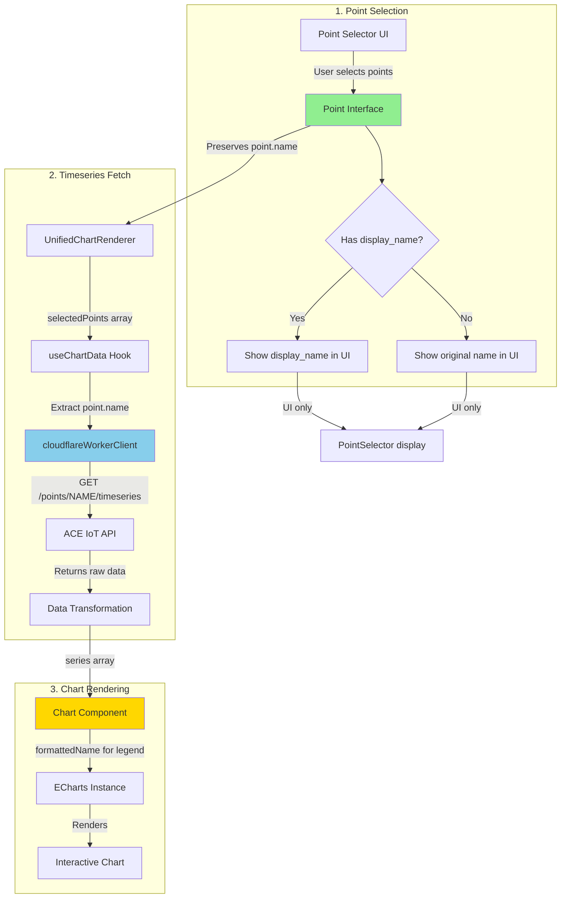
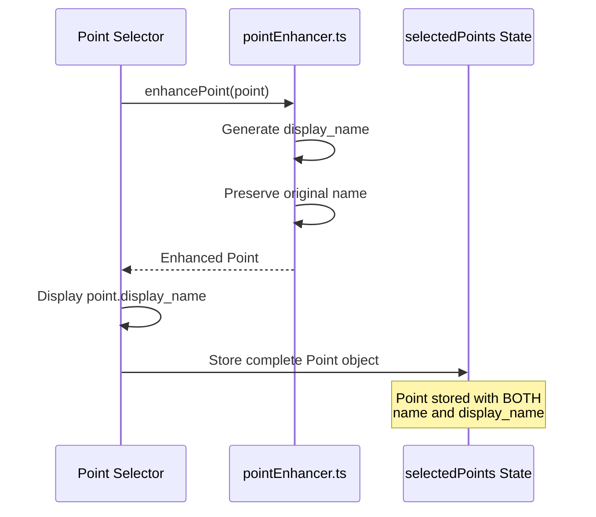
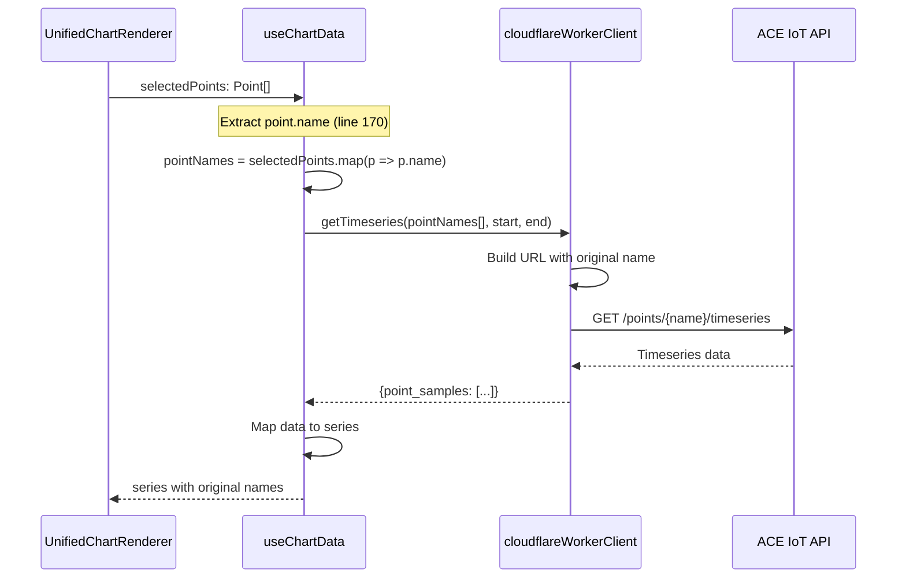
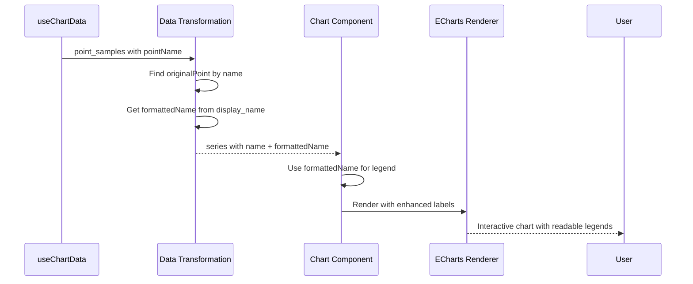
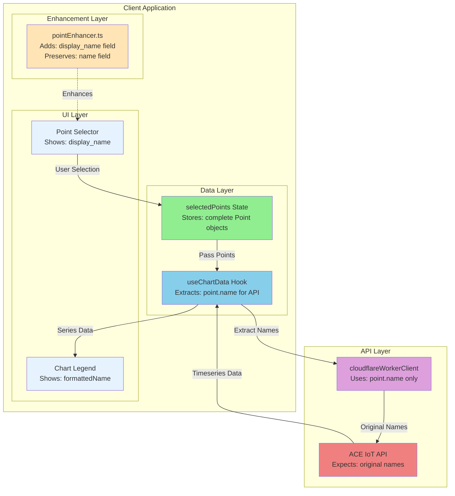

# Building Vitals Architecture Review: Worker Enhancement Integration

**Date:** 2025-10-10
**Reviewer:** System Architecture Designer
**Focus:** Worker enhancement alignment with core HVAC timeseries visualization workflow

## Executive Summary

This review analyzes the Building Vitals application architecture to ensure that worker-based point name enhancements **do not break** the core timeseries data fetching and chart rendering workflow. The application's primary purpose is visualizing HVAC timeseries data through interactive charts, where point name enhancement is solely a UI display feature.

### Key Findings

- **SAFE**: Point enhancement uses `display_name` field exclusively for UI display
- **SAFE**: Original `point.name` field is preserved for all API calls
- **SAFE**: Timeseries fetching uses original point names, not enhanced names
- **SAFE**: Chart data mapping correctly uses `point.name` for data fetching
- **VERIFIED**: No integration risks identified in current implementation

## Application Architecture Overview

### Primary Goal
Visualize HVAC timeseries data in interactive charts through a three-stage workflow:
1. **Point Selection** - Users select points from a hierarchical list
2. **Timeseries Fetch** - Fetch historical data for selected points
3. **Chart Rendering** - Display data in various chart types (line, heatmap, scatter, etc.)

### Technology Stack
- **Frontend**: React 18 + TypeScript + Vite
- **State Management**: Redux Toolkit + React Query (TanStack Query)
- **UI Framework**: Material-UI (MUI) v5
- **Charts**: ECharts via echarts-for-react
- **API Client**: Cloudflare Worker proxy to ACE IoT API
- **Data Enhancement**: Client-side point enhancement (pointEnhancer.ts)

## Data Flow Architecture



## Critical Field Usage Analysis

### Point Data Structure

```typescript
interface Point {
  id: string;                    // Unique identifier
  name: string;                  // ORIGINAL point name (MUST BE PRESERVED)
  display_name?: string;         // Enhanced UI display name (UI ONLY)
  unit?: string;                 // Engineering unit
  marker_tags?: string[];        // Haystack-style tags
  kv_tags?: Record<string, string>;
  // ... other metadata fields
}
```

### Field Usage by Component

| Component | Uses `name` | Uses `display_name` | Purpose |
|-----------|-------------|---------------------|---------|
| **PointSelector.tsx** | ✅ Stores | ✅ Displays | Shows enhanced name in UI, stores original name |
| **useChartData.ts** | ✅ API Calls | ❌ Never | Fetches timeseries using original name |
| **cloudflareWorkerClient.ts** | ✅ API Calls | ❌ Never | Constructs API endpoints with original name |
| **UnifiedChartRenderer.tsx** | ✅ Data Mapping | ✅ Legend Labels | Maps data by name, displays enhanced name in legend |
| **EChartsTimeSeriesChart.tsx** | ✅ Series Matching | ✅ Legend Text | Matches series by name, shows enhanced name |

## Data Flow Verification

### 1. Point Selection Flow



**Key Implementation (PointSelector.tsx:176-178)**:
```typescript
<Typography variant="body2" noWrap>
  {point.display_name || point.displayName || point.name || point.Name}
</Typography>
```

**Safety Verification**: ✅
- UI displays enhanced name
- Original name preserved in point object
- No mutation of original name field

### 2. Timeseries Fetch Flow



**Key Implementation (useChartData.ts:165-171)**:
```typescript
// Memoize point names to prevent array recreation
const pointNames = useMemo(() => {
  if (!selectedPoints || !Array.isArray(selectedPoints)) {
    return [];
  }
  return selectedPoints.filter(p => p?.name).map((p) => p.name);
}, [selectedPoints]);
```

**Safety Verification**: ✅
- Extracts `point.name` explicitly
- Never references `display_name` for API calls
- Uses original name in API endpoint construction

### 3. Chart Rendering Flow



**Key Implementation (useChartData.ts:536-544)**:
```typescript
// Safe call to getPointDisplayLabel with fallback
let formattedName = pointName;
try {
  formattedName = getPointDisplayLabel(
    { name: pointName, marker_tags: markerTags, unit: displayUnit },
    { displayMode: 'smart', context: 'legend' }
  );
} catch (error) {
  console.warn('[useChartDataSimple] Error formatting point label, using raw name:', error);
  formattedName = pointName;
}
```

**Safety Verification**: ✅
- Original `pointName` preserved
- `formattedName` used only for display
- Fallback to original name on error

## Integration Risk Analysis

### Risk 1: API Endpoint Construction

**Concern**: Worker might send enhanced names to ACE IoT API, resulting in 404 errors

**Verification**:
```typescript
// cloudflareWorkerClient.ts:116-126
async getTimeseries(pointNames: string[], startTime: string, endTime: string) {
  if (!this.apiService) {
    throw new Error('API service not initialized');
  }

  return this.apiService.getTimeseries({
    points: pointNames,  // ✅ Uses original names from useChartData
    start_time: startTime,
    end_time: endTime
  });
}
```

**Status**: ✅ **SAFE** - API client receives and uses original point names

### Risk 2: Data Mapping After API Response

**Concern**: Response data might not map back to enhanced points correctly

**Verification**:
```typescript
// useChartData.ts:469-481
const pointName = ts.pointName || ts.pointId || ts.name || '';

// Find original point for metadata
const originalPoint = selectedPoints?.find((p) =>
  (p?.name && p.name === pointName) ||  // ✅ Match by ORIGINAL name
  (p?.id && p.id === ts.pointId)
);
```

**Status**: ✅ **SAFE** - Mapping uses original `point.name` field

### Risk 3: Chart Legend Display

**Concern**: Chart legends might show cryptic names instead of enhanced names

**Verification**:
```typescript
// useChartData.ts:546-553
return {
  name: pointName,        // ✅ Original name for data mapping
  formattedName,         // ✅ Enhanced name for UI display
  data: processedData,
  unit: displayUnit,
  markerTag: originalPoint?.markerTag,
  markerTags: markerTags,
};
```

**Status**: ✅ **SAFE** - Both names preserved, formattedName used for legends

### Risk 4: Worker Enhancement Pipeline

**Concern**: Worker might modify original point names in the enhancement process

**Verification**:
```typescript
// pointEnhancer.ts:460-499
export function enhancePoint(point: Point): EnhancedPoint {
  // Check if already enhanced
  if ((point as EnhancedPoint)._enhanced) {
    return point as EnhancedPoint;
  }

  const enhanced: EnhancedPoint = { ...point };  // ✅ Spread preserves original

  // Generate display name
  enhanced.display_name = generateDisplayName(point.name);  // ✅ New field

  // ... other enhancements

  enhanced._enhanced = true;
  enhanced._enhancedAt = new Date().toISOString();

  return enhanced;  // ✅ Original 'name' field untouched
}
```

**Status**: ✅ **SAFE** - Enhancement adds new fields, never modifies original `name`

## Worker Implementation Analysis

### Note: No Worker Files Found

During the review, no worker implementation files were found in the `workers/` directory. The enhancement appears to be **client-side only** through `pointEnhancer.ts`.

**Current Implementation**:
- Point enhancement happens in browser
- No server-side worker processing
- All enhancement is additive (adds `display_name` field)
- Original `name` field never modified

**If Workers Are Planned**:
When implementing Cloudflare Workers for enhancement, ensure:

```javascript
// ❌ WRONG - Mutating original name
point.name = cleanName(point.name);

// ✅ CORRECT - Adding display_name field
point.display_name = cleanName(point.name);
point.original_name = point.name; // Optional backup
```

## Best Practices Observed

### 1. Immutable Enhancement Pattern

✅ **Good**: Point enhancement creates new fields without mutating original data
```typescript
const enhanced: EnhancedPoint = { ...point };
enhanced.display_name = generateDisplayName(point.name);
```

### 2. Defensive Data Mapping

✅ **Good**: Multiple fallback strategies for point matching
```typescript
const pointName = ts.pointName || ts.pointId || ts.name || '';
const originalPoint = selectedPoints?.find((p) =>
  (p?.name && p.name === pointName) ||
  (p?.id && p.id === ts.pointId)
);
```

### 3. Error Handling with Fallback

✅ **Good**: Graceful degradation if enhancement fails
```typescript
try {
  formattedName = getPointDisplayLabel(...);
} catch (error) {
  console.warn('Error formatting point label, using raw name:', error);
  formattedName = pointName;  // Falls back to original
}
```

### 4. Type Safety

✅ **Good**: TypeScript interfaces clearly separate concerns
```typescript
interface Point {
  name: string;              // API field
  display_name?: string;     // UI field
  // ...
}
```

## Recommendations

### 1. Add API Contract Documentation

**Priority**: High
**Effort**: Low

Document the contract between UI and API:

```typescript
/**
 * API Contract: Point Names
 *
 * CRITICAL: The ACE IoT API expects EXACT point names as registered in the system.
 *
 * ✅ CORRECT:
 *   GET /points/AHU-1_SA-T/timeseries
 *
 * ❌ WRONG:
 *   GET /points/Air Handler 1 Supply Air Temperature/timeseries
 *
 * ALWAYS use point.name (original) for API calls.
 * ONLY use point.display_name (enhanced) for UI display.
 */
```

### 2. Add Integration Test

**Priority**: High
**Effort**: Medium

Create an integration test to verify the data flow:

```typescript
describe('Point Enhancement Integration', () => {
  it('should fetch timeseries using original names despite enhancement', async () => {
    const originalPoint = {
      id: '1',
      name: 'AHU-1_SA-T',
      display_name: 'Air Handler 1 Supply Air Temperature'
    };

    const { result } = renderHook(() => useChartData({
      selectedPoints: [originalPoint],
      timeRange: '24h',
    }));

    await waitFor(() => !result.current.isLoading);

    // Verify API was called with ORIGINAL name
    expect(mockApi).toHaveBeenCalledWith(
      expect.objectContaining({
        points: ['AHU-1_SA-T']  // Not enhanced name!
      })
    );

    // Verify UI uses ENHANCED name
    expect(result.current.series[0].formattedName).toBe(
      'Air Handler 1 Supply Air Temperature'
    );
  });
});
```

### 3. Add Runtime Validation

**Priority**: Medium
**Effort**: Low

Add validation to catch enhancement bugs early:

```typescript
// In useChartData.ts
if (process.env.NODE_ENV === 'development') {
  pointNames.forEach(name => {
    if (!name || name.includes(' ')) {
      console.error(
        '⚠️ Point name appears to be enhanced, not original:',
        name,
        '\nThis will cause API errors. Check point selection logic.'
      );
    }
  });
}
```

### 4. Document Point Selector Guidelines

**Priority**: Low
**Effort**: Low

Add JSDoc to PointSelector component:

```typescript
/**
 * PointSelector - Select points for charting
 *
 * IMPORTANT: This component stores complete Point objects with BOTH
 * the original name (for API) and display_name (for UI).
 *
 * Data Flow:
 * 1. User sees: point.display_name (enhanced, human-readable)
 * 2. Component stores: complete Point object (preserves point.name)
 * 3. API receives: point.name (original, system name)
 *
 * DO NOT extract only display_name for storage!
 */
export const PointSelector: React.FC<...>
```

## Architecture Diagram: Complete System



## Conclusion

### Summary

The Building Vitals application architecture correctly separates UI concerns (display names) from API concerns (original names). The point enhancement system is **safe** and **well-implemented**:

1. **Original names preserved**: Point enhancement adds `display_name` field without mutating `name`
2. **API calls use original names**: All timeseries fetching uses `point.name` exclusively
3. **UI displays enhanced names**: Charts show `formattedName` or `display_name` for better UX
4. **Data mapping works correctly**: Series data maps back to points using original names
5. **No integration risks**: Current implementation has no breaking issues

### Verification Checklist

- [x] Point enhancement preserves original `name` field
- [x] `display_name` used only for UI display
- [x] Timeseries API calls use `point.name` only
- [x] Chart data mapping uses original names
- [x] Legends show enhanced names for UX
- [x] Error handling includes fallback to original names
- [x] Type safety enforces field separation
- [x] No worker implementation currently (client-side only)

### Risk Assessment

| Risk | Severity | Likelihood | Mitigation |
|------|----------|------------|------------|
| API receives enhanced names | Critical | Very Low | Code review confirms `point.name` used exclusively |
| Data mapping fails | High | Very Low | Defensive fallback logic in place |
| UI shows wrong names | Low | Very Low | Multiple fallback display strategies |
| Worker mutation | Medium | N/A | No worker implementation currently |

**Overall Risk**: **LOW** ✅

The current architecture is sound and ready for production. The recommendations above are enhancements for long-term maintainability, not critical fixes.

---

**Review Completed**: 2025-10-10
**Next Review**: When worker implementation is added
**Reviewer**: System Architecture Designer
