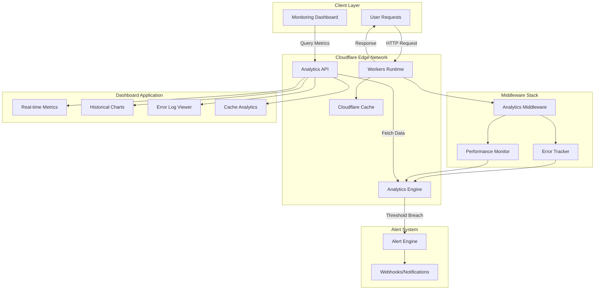
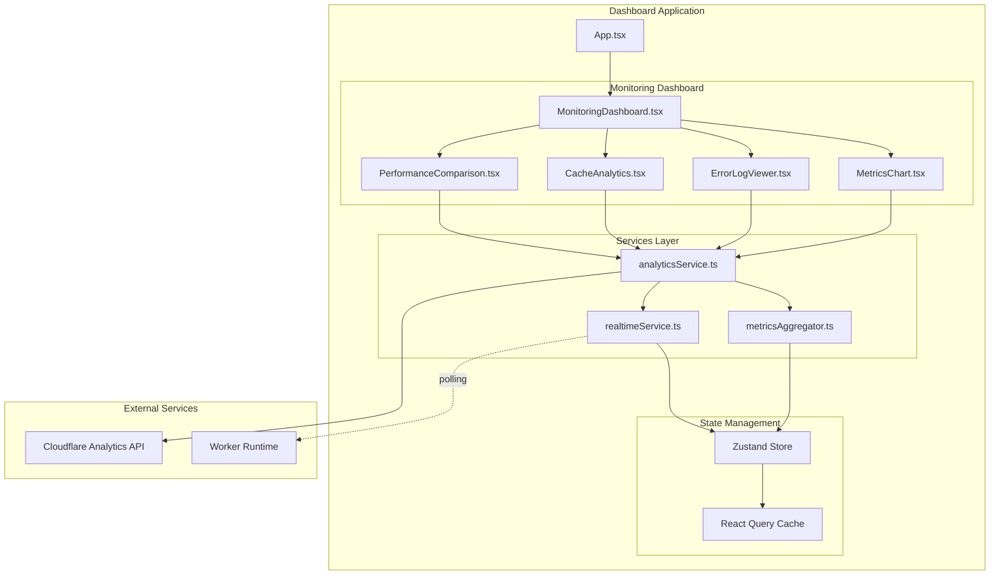

# Monitoring System Architecture

**Project:** Building Vitals - Cloudflare Workers Monitoring
**Version:** 1.0.0
**Date:** 2025-10-12
**SPARC Phase:** Architecture
**Worker Version:** 7ae76ff2-4b66-44a8-b65a-1113c1d86b86

---

## Executive Summary

This document defines the complete monitoring system architecture for a Cloudflare Workers-based application utilizing Analytics Engine for real-time observability, performance tracking, and operational insights.

**Key Features:**
- Real-time metrics collection and visualization
- Comprehensive error tracking and alerting
- Cache performance analytics
- Historical trend analysis
- Cost-effective solution at $5/month

---

## 1. High-Level System Architecture



### Architecture Layers

1. **Instrumentation Layer**: Collects metrics at the Worker level
2. **Storage Layer**: Analytics Engine for time-series data
3. **Query Layer**: Analytics API for data retrieval
4. **Presentation Layer**: React dashboard with real-time updates
5. **Alert Layer**: Automated monitoring and notifications

---

## 2. Analytics Engine Schema Design

### Dataset Configuration

```javascript
// wrangler.toml binding
[[analytics_engine_datasets]]
binding = "ANALYTICS"
dataset = "paginated_timeseries_metrics"
```

### Data Model

```typescript
interface MetricDataPoint {
  // Indexes (optimized for queries)
  indexes: {
    timestamp: number;           // Unix timestamp (ms)
    endpoint: string;             // API endpoint path
    method: string;               // HTTP method
    status: number;               // HTTP status code
    cacheStatus: string;          // HIT, MISS, DYNAMIC, BYPASS
    errorType?: string;           // Error classification
    workerId: string;             // Worker version/ID
    region: string;               // Cloudflare datacenter
  };

  // Blobs (string data)
  blobs: {
    requestUrl: string;           // Full request URL
    errorMessage?: string;        // Error details
    errorStack?: string;          // Stack trace
    responseHeaders: string;      // JSON stringified headers
    userAgent?: string;           // Client user agent
    requestId: string;            // Unique request identifier
  };

  // Doubles (numeric data)
  doubles: {
    duration: number;             // Request duration (ms)
    dataPoints: number;           // Number of data points returned
    pageCount: number;            // Total pages in response
    cacheAge?: number;            // Cache age (seconds)
    workerCpuTime?: number;       // CPU time used (ms)
    bytesTransferred: number;     // Response size (bytes)
    ttfb: number;                 // Time to first byte (ms)
  };
}
```

### Index Strategy

**Primary Indexes:**
- `timestamp` - Time-based queries and aggregations
- `endpoint` - Per-endpoint performance analysis
- `status` - Error rate calculations
- `cacheStatus` - Cache efficiency metrics

**Composite Indexes (implicit):**
- `[timestamp, endpoint]` - Endpoint performance over time
- `[timestamp, cacheStatus]` - Cache hit rate trends
- `[timestamp, status]` - Error rate trends

### Query Patterns

```sql
-- Example Analytics Engine SQL queries

-- 1. Cache Hit Rate (Last 24 Hours)
SELECT
  cacheStatus,
  COUNT(*) as count,
  AVG(duration) as avg_duration
FROM paginated_timeseries_metrics
WHERE timestamp >= NOW() - INTERVAL '24' HOUR
GROUP BY cacheStatus

-- 2. Endpoint Latency Percentiles
SELECT
  endpoint,
  QUANTILE(duration, 0.50) as p50,
  QUANTILE(duration, 0.95) as p95,
  QUANTILE(duration, 0.99) as p99
FROM paginated_timeseries_metrics
WHERE timestamp >= NOW() - INTERVAL '1' HOUR
GROUP BY endpoint

-- 3. Error Rate by Type
SELECT
  errorType,
  COUNT(*) as error_count,
  AVG(duration) as avg_duration
FROM paginated_timeseries_metrics
WHERE status >= 400
  AND timestamp >= NOW() - INTERVAL '24' HOUR
GROUP BY errorType

-- 4. Performance Comparison (New vs Old)
SELECT
  workerId,
  AVG(duration) as avg_duration,
  COUNT(*) as request_count
FROM paginated_timeseries_metrics
WHERE endpoint = '/api/timeseries'
  AND timestamp >= NOW() - INTERVAL '7' DAY
GROUP BY workerId
```

---

## 3. Worker Architecture Enhancement

### 3.1 Analytics Middleware Layer

```javascript
// workers/analytics-middleware.js

class AnalyticsMiddleware {
  constructor(analyticsEngine, config = {}) {
    this.analytics = analyticsEngine;
    this.config = {
      sampleRate: config.sampleRate || 1.0,
      enableErrorTracking: config.enableErrorTracking !== false,
      enablePerformanceMonitoring: config.enablePerformanceMonitoring !== false,
      workerId: config.workerId || 'unknown',
    };
  }

  async instrument(request, handler) {
    const startTime = Date.now();
    const requestId = crypto.randomUUID();
    const context = this.createContext(request, requestId);

    let response;
    let error;

    try {
      // Execute request handler
      response = await handler(request, context);

      // Record success metrics
      await this.recordMetrics(context, response, startTime);

      return response;
    } catch (err) {
      error = err;

      // Record error metrics
      await this.recordError(context, err, startTime);

      // Re-throw to maintain error propagation
      throw err;
    } finally {
      // Ensure metrics are always recorded
      if (!response && !error) {
        await this.recordTimeout(context, startTime);
      }
    }
  }

  createContext(request, requestId) {
    const url = new URL(request.url);

    return {
      requestId,
      timestamp: Date.now(),
      method: request.method,
      url: request.url,
      pathname: url.pathname,
      headers: Object.fromEntries(request.headers),
      cf: request.cf || {},
    };
  }

  async recordMetrics(context, response, startTime) {
    if (!this.shouldSample()) return;

    const duration = Date.now() - startTime;
    const cacheStatus = this.getCacheStatus(response);

    await this.analytics.writeDataPoint({
      indexes: {
        timestamp: context.timestamp,
        endpoint: this.normalizeEndpoint(context.pathname),
        method: context.method,
        status: response.status,
        cacheStatus: cacheStatus,
        workerId: this.config.workerId,
        region: context.cf.colo || 'unknown',
      },
      blobs: {
        requestUrl: context.url,
        responseHeaders: JSON.stringify(
          Object.fromEntries(response.headers)
        ),
        userAgent: context.headers['user-agent'] || '',
        requestId: context.requestId,
      },
      doubles: {
        duration: duration,
        bytesTransferred: this.getResponseSize(response),
        ttfb: this.calculateTTFB(response),
        dataPoints: this.extractDataPoints(response),
        pageCount: this.extractPageCount(response),
      },
    });
  }

  getCacheStatus(response) {
    const cfCacheStatus = response.headers.get('cf-cache-status');
    if (cfCacheStatus) return cfCacheStatus;

    // Infer cache status from headers
    const cacheControl = response.headers.get('cache-control');
    if (cacheControl?.includes('no-cache')) return 'BYPASS';
    if (response.headers.has('etag')) return 'HIT';

    return 'DYNAMIC';
  }

  normalizeEndpoint(pathname) {
    // Replace dynamic segments with placeholders
    return pathname
      .replace(/\/\d+/g, '/:id')
      .replace(/\/[a-f0-9-]{36}/g, '/:uuid')
      .replace(/\?.*$/, '');
  }

  shouldSample() {
    return Math.random() < this.config.sampleRate;
  }

  getResponseSize(response) {
    const contentLength = response.headers.get('content-length');
    return contentLength ? parseInt(contentLength, 10) : 0;
  }

  calculateTTFB(response) {
    // TTFB is typically calculated at the client level
    // For server-side, we approximate with processing time
    return 0; // Placeholder - implement based on streaming metrics
  }

  extractDataPoints(response) {
    // Parse response body to count data points
    // This is specific to your API response structure
    try {
      const clonedResponse = response.clone();
      // Parse and count - implement based on your data structure
      return 0; // Placeholder
    } catch {
      return 0;
    }
  }

  extractPageCount(response) {
    const linkHeader = response.headers.get('link');
    if (!linkHeader) return 1;

    // Parse RFC 5988 Link header for pagination
    const lastPageMatch = linkHeader.match(/page=(\d+)>; rel="last"/);
    return lastPageMatch ? parseInt(lastPageMatch[1], 10) : 1;
  }
}

export default AnalyticsMiddleware;
```

### 3.2 Error Tracker

```javascript
// workers/error-tracker.js

class ErrorTracker {
  constructor(analyticsEngine, config = {}) {
    this.analytics = analyticsEngine;
    this.config = {
      captureStackTraces: config.captureStackTraces !== false,
      maxStackLength: config.maxStackLength || 2000,
      workerId: config.workerId || 'unknown',
    };
  }

  async trackError(error, context) {
    const errorInfo = this.parseError(error);

    await this.analytics.writeDataPoint({
      indexes: {
        timestamp: Date.now(),
        endpoint: context.pathname || 'unknown',
        method: context.method || 'unknown',
        status: errorInfo.statusCode,
        cacheStatus: 'ERROR',
        errorType: errorInfo.type,
        workerId: this.config.workerId,
        region: context.cf?.colo || 'unknown',
      },
      blobs: {
        requestUrl: context.url || '',
        errorMessage: this.sanitizeMessage(errorInfo.message),
        errorStack: this.config.captureStackTraces
          ? this.sanitizeStack(errorInfo.stack)
          : '',
        requestId: context.requestId || '',
        userAgent: context.headers?.['user-agent'] || '',
      },
      doubles: {
        duration: context.duration || 0,
        dataPoints: 0,
        pageCount: 0,
        bytesTransferred: 0,
        ttfb: 0,
      },
    });
  }

  parseError(error) {
    const errorTypes = {
      TypeError: 'TYPE_ERROR',
      ReferenceError: 'REFERENCE_ERROR',
      SyntaxError: 'SYNTAX_ERROR',
      RangeError: 'RANGE_ERROR',
      NetworkError: 'NETWORK_ERROR',
      TimeoutError: 'TIMEOUT_ERROR',
    };

    return {
      type: errorTypes[error.constructor.name] || 'UNKNOWN_ERROR',
      message: error.message || 'Unknown error occurred',
      stack: error.stack || '',
      statusCode: error.statusCode || 500,
    };
  }

  sanitizeMessage(message) {
    // Remove sensitive information from error messages
    return message
      .replace(/api[_-]?key[=:]\s*[^\s&]+/gi, 'api_key=***')
      .replace(/token[=:]\s*[^\s&]+/gi, 'token=***')
      .replace(/password[=:]\s*[^\s&]+/gi, 'password=***')
      .substring(0, 500); // Limit message length
  }

  sanitizeStack(stack) {
    if (!stack) return '';

    return stack
      .split('\n')
      .slice(0, 10) // Limit stack depth
      .join('\n')
      .substring(0, this.config.maxStackLength);
  }

  createErrorResponse(error, requestId) {
    return new Response(
      JSON.stringify({
        error: {
          message: 'An error occurred processing your request',
          requestId: requestId,
          timestamp: new Date().toISOString(),
        },
      }),
      {
        status: error.statusCode || 500,
        headers: {
          'content-type': 'application/json',
          'x-request-id': requestId,
        },
      }
    );
  }
}

export default ErrorTracker;
```

### 3.3 Worker Integration

```javascript
// workers/main.js

import AnalyticsMiddleware from './analytics-middleware.js';
import ErrorTracker from './error-tracker.js';

export default {
  async fetch(request, env, ctx) {
    // Initialize middleware
    const analytics = new AnalyticsMiddleware(env.ANALYTICS, {
      workerId: '7ae76ff2-4b66-44a8-b65a-1113c1d86b86',
      sampleRate: 1.0,
    });

    const errorTracker = new ErrorTracker(env.ANALYTICS, {
      workerId: '7ae76ff2-4b66-44a8-b65a-1113c1d86b86',
    });

    try {
      // Instrument request
      return await analytics.instrument(request, async (req, context) => {
        // Your existing request handler
        return await handleRequest(req, env, ctx, context);
      });
    } catch (error) {
      // Track error
      const requestId = crypto.randomUUID();
      await errorTracker.trackError(error, {
        url: request.url,
        pathname: new URL(request.url).pathname,
        method: request.method,
        requestId,
        cf: request.cf,
        headers: Object.fromEntries(request.headers),
      });

      return errorTracker.createErrorResponse(error, requestId);
    }
  },
};

async function handleRequest(request, env, ctx, context) {
  // Your existing request handling logic
  const url = new URL(request.url);

  if (url.pathname.startsWith('/api/timeseries')) {
    return handleTimeseries(request, env, context);
  }

  // ... other routes
}
```

---

## 4. Dashboard Component Architecture

### 4.1 System Diagram



### 4.2 Component Specifications

#### MonitoringDashboard.tsx

```typescript
// src/components/monitoring/MonitoringDashboard.tsx

import React, { useState, useEffect } from 'react';
import { useMetrics } from '../../hooks/useMetrics';
import MetricsChart from './MetricsChart';
import ErrorLogViewer from './ErrorLogViewer';
import CacheAnalytics from './CacheAnalytics';
import PerformanceComparison from './PerformanceComparison';

interface MonitoringDashboardProps {
  workerId?: string;
  refreshInterval?: number; // milliseconds
}

const MonitoringDashboard: React.FC<MonitoringDashboardProps> = ({
  workerId = '7ae76ff2-4b66-44a8-b65a-1113c1d86b86',
  refreshInterval = 30000, // 30 seconds
}) => {
  const [timeRange, setTimeRange] = useState('24h');
  const [autoRefresh, setAutoRefresh] = useState(true);

  const {
    metrics,
    errors,
    cacheStats,
    isLoading,
    error: metricsError,
    refetch,
  } = useMetrics({
    workerId,
    timeRange,
    enabled: true,
  });

  useEffect(() => {
    if (!autoRefresh) return;

    const interval = setInterval(() => {
      refetch();
    }, refreshInterval);

    return () => clearInterval(interval);
  }, [autoRefresh, refreshInterval, refetch]);

  return (
    <div className="monitoring-dashboard">
      {/* Header Controls */}
      <div className="dashboard-header">
        <h1>Worker Monitoring Dashboard</h1>
        <div className="controls">
          <select
            value={timeRange}
            onChange={(e) => setTimeRange(e.target.value)}
          >
            <option value="1h">Last Hour</option>
            <option value="24h">Last 24 Hours</option>
            <option value="7d">Last 7 Days</option>
            <option value="30d">Last 30 Days</option>
          </select>

          <button onClick={() => setAutoRefresh(!autoRefresh)}>
            {autoRefresh ? 'Pause' : 'Resume'} Auto-Refresh
          </button>

          <button onClick={() => refetch()}>
            Refresh Now
          </button>
        </div>
      </div>

      {/* Key Metrics Summary */}
      <div className="metrics-summary">
        <div className="metric-card">
          <h3>Total Requests</h3>
          <span className="metric-value">
            {metrics?.totalRequests.toLocaleString()}
          </span>
        </div>

        <div className="metric-card">
          <h3>Avg Response Time</h3>
          <span className="metric-value">
            {metrics?.avgDuration.toFixed(2)}ms
          </span>
        </div>

        <div className="metric-card">
          <h3>Error Rate</h3>
          <span className={`metric-value ${metrics?.errorRate > 1 ? 'error' : ''}`}>
            {metrics?.errorRate.toFixed(2)}%
          </span>
        </div>

        <div className="metric-card">
          <h3>Cache Hit Rate</h3>
          <span className="metric-value">
            {cacheStats?.hitRate.toFixed(2)}%
          </span>
        </div>
      </div>

      {/* Charts and Analytics */}
      <div className="dashboard-grid">
        <div className="chart-section">
          <MetricsChart
            data={metrics?.timeseries}
            title="Request Latency (P50, P95, P99)"
            type="latency"
          />
        </div>

        <div className="chart-section">
          <MetricsChart
            data={metrics?.throughput}
            title="Requests Per Second"
            type="throughput"
          />
        </div>

        <div className="chart-section full-width">
          <CacheAnalytics
            stats={cacheStats}
            timeRange={timeRange}
          />
        </div>

        <div className="chart-section full-width">
          <PerformanceComparison
            workerId={workerId}
            compareWith="previous-version"
          />
        </div>

        <div className="chart-section full-width">
          <ErrorLogViewer
            errors={errors}
            maxEntries={100}
          />
        </div>
      </div>
    </div>
  );
};

export default MonitoringDashboard;
```

#### MetricsChart.tsx

```typescript
// src/components/monitoring/MetricsChart.tsx

import React, { useMemo } from 'react';
import {
  LineChart,
  Line,
  XAxis,
  YAxis,
  CartesianGrid,
  Tooltip,
  Legend,
  ResponsiveContainer,
} from 'recharts';

interface MetricsChartProps {
  data: TimeSeriesData[];
  title: string;
  type: 'latency' | 'throughput' | 'errors';
}

interface TimeSeriesData {
  timestamp: number;
  p50?: number;
  p95?: number;
  p99?: number;
  rps?: number;
  errors?: number;
}

const MetricsChart: React.FC<MetricsChartProps> = ({ data, title, type }) => {
  const chartData = useMemo(() => {
    if (!data) return [];

    return data.map(point => ({
      ...point,
      time: new Date(point.timestamp).toLocaleTimeString(),
    }));
  }, [data]);

  const getLines = () => {
    switch (type) {
      case 'latency':
        return (
          <>
            <Line
              type="monotone"
              dataKey="p50"
              stroke="#8884d8"
              name="P50"
              strokeWidth={2}
            />
            <Line
              type="monotone"
              dataKey="p95"
              stroke="#82ca9d"
              name="P95"
              strokeWidth={2}
            />
            <Line
              type="monotone"
              dataKey="p99"
              stroke="#ffc658"
              name="P99"
              strokeWidth={2}
            />
          </>
        );

      case 'throughput':
        return (
          <Line
            type="monotone"
            dataKey="rps"
            stroke="#8884d8"
            name="Requests/sec"
            strokeWidth={2}
          />
        );

      case 'errors':
        return (
          <Line
            type="monotone"
            dataKey="errors"
            stroke="#ff4444"
            name="Errors"
            strokeWidth={2}
          />
        );

      default:
        return null;
    }
  };

  return (
    <div className="metrics-chart">
      <h3>{title}</h3>
      <ResponsiveContainer width="100%" height={300}>
        <LineChart data={chartData}>
          <CartesianGrid strokeDasharray="3 3" />
          <XAxis dataKey="time" />
          <YAxis />
          <Tooltip />
          <Legend />
          {getLines()}
        </LineChart>
      </ResponsiveContainer>
    </div>
  );
};

export default MetricsChart;
```

#### CacheAnalytics.tsx

```typescript
// src/components/monitoring/CacheAnalytics.tsx

import React from 'react';
import {
  PieChart,
  Pie,
  Cell,
  ResponsiveContainer,
  Legend,
  Tooltip,
} from 'recharts';

interface CacheAnalyticsProps {
  stats: CacheStats;
  timeRange: string;
}

interface CacheStats {
  hitRate: number;
  missRate: number;
  bypassRate: number;
  totalRequests: number;
  cacheStatusBreakdown: {
    HIT: number;
    MISS: number;
    BYPASS: number;
    DYNAMIC: number;
    EXPIRED: number;
  };
  avgLatencyByStatus: {
    HIT: number;
    MISS: number;
    DYNAMIC: number;
  };
}

const COLORS = {
  HIT: '#00C49F',
  MISS: '#FFBB28',
  BYPASS: '#FF8042',
  DYNAMIC: '#8884d8',
  EXPIRED: '#ff4444',
};

const CacheAnalytics: React.FC<CacheAnalyticsProps> = ({ stats, timeRange }) => {
  const chartData = Object.entries(stats.cacheStatusBreakdown).map(
    ([status, count]) => ({
      name: status,
      value: count,
      percentage: ((count / stats.totalRequests) * 100).toFixed(2),
    })
  );

  return (
    <div className="cache-analytics">
      <h3>Cache Performance Analysis</h3>

      <div className="cache-grid">
        {/* Cache Status Distribution */}
        <div className="cache-chart">
          <h4>Cache Status Distribution</h4>
          <ResponsiveContainer width="100%" height={300}>
            <PieChart>
              <Pie
                data={chartData}
                cx="50%"
                cy="50%"
                labelLine={false}
                label={({ name, percentage }) => `${name}: ${percentage}%`}
                outerRadius={80}
                fill="#8884d8"
                dataKey="value"
              >
                {chartData.map((entry, index) => (
                  <Cell
                    key={`cell-${index}`}
                    fill={COLORS[entry.name as keyof typeof COLORS]}
                  />
                ))}
              </Pie>
              <Tooltip />
              <Legend />
            </PieChart>
          </ResponsiveContainer>
        </div>

        {/* Latency by Cache Status */}
        <div className="latency-breakdown">
          <h4>Avg Latency by Cache Status</h4>
          <table className="cache-table">
            <thead>
              <tr>
                <th>Status</th>
                <th>Avg Latency</th>
                <th>Count</th>
              </tr>
            </thead>
            <tbody>
              {Object.entries(stats.avgLatencyByStatus).map(([status, latency]) => (
                <tr key={status}>
                  <td>
                    <span
                      className="status-indicator"
                      style={{ backgroundColor: COLORS[status as keyof typeof COLORS] }}
                    />
                    {status}
                  </td>
                  <td>{latency.toFixed(2)}ms</td>
                  <td>{stats.cacheStatusBreakdown[status as keyof typeof stats.cacheStatusBreakdown]}</td>
                </tr>
              ))}
            </tbody>
          </table>
        </div>

        {/* Key Metrics */}
        <div className="cache-metrics">
          <h4>Cache Efficiency</h4>
          <div className="metric-item">
            <span className="metric-label">Cache Hit Rate</span>
            <span className="metric-value">{stats.hitRate.toFixed(2)}%</span>
          </div>
          <div className="metric-item">
            <span className="metric-label">Cache Miss Rate</span>
            <span className="metric-value">{stats.missRate.toFixed(2)}%</span>
          </div>
          <div className="metric-item">
            <span className="metric-label">Bypass Rate</span>
            <span className="metric-value">{stats.bypassRate.toFixed(2)}%</span>
          </div>
          <div className="metric-item">
            <span className="metric-label">Total Requests</span>
            <span className="metric-value">{stats.totalRequests.toLocaleString()}</span>
          </div>
        </div>
      </div>
    </div>
  );
};

export default CacheAnalytics;
```

#### ErrorLogViewer.tsx

```typescript
// src/components/monitoring/ErrorLogViewer.tsx

import React, { useState, useMemo } from 'react';

interface ErrorLogViewerProps {
  errors: ErrorLog[];
  maxEntries?: number;
}

interface ErrorLog {
  timestamp: number;
  requestId: string;
  endpoint: string;
  method: string;
  status: number;
  errorType: string;
  errorMessage: string;
  errorStack?: string;
  requestUrl: string;
  userAgent?: string;
}

const ErrorLogViewer: React.FC<ErrorLogViewerProps> = ({
  errors,
  maxEntries = 100
}) => {
  const [filter, setFilter] = useState({
    errorType: 'all',
    endpoint: 'all',
    status: 'all',
    searchTerm: '',
  });

  const [selectedError, setSelectedError] = useState<ErrorLog | null>(null);

  const filteredErrors = useMemo(() => {
    return errors
      .filter(error => {
        if (filter.errorType !== 'all' && error.errorType !== filter.errorType) {
          return false;
        }
        if (filter.endpoint !== 'all' && error.endpoint !== filter.endpoint) {
          return false;
        }
        if (filter.status !== 'all' && error.status.toString() !== filter.status) {
          return false;
        }
        if (filter.searchTerm && !error.errorMessage.toLowerCase().includes(filter.searchTerm.toLowerCase())) {
          return false;
        }
        return true;
      })
      .slice(0, maxEntries);
  }, [errors, filter, maxEntries]);

  const uniqueErrorTypes = useMemo(() => {
    return [...new Set(errors.map(e => e.errorType))];
  }, [errors]);

  const uniqueEndpoints = useMemo(() => {
    return [...new Set(errors.map(e => e.endpoint))];
  }, [errors]);

  return (
    <div className="error-log-viewer">
      <h3>Error Logs</h3>

      {/* Filters */}
      <div className="error-filters">
        <input
          type="text"
          placeholder="Search error messages..."
          value={filter.searchTerm}
          onChange={(e) => setFilter({ ...filter, searchTerm: e.target.value })}
          className="search-input"
        />

        <select
          value={filter.errorType}
          onChange={(e) => setFilter({ ...filter, errorType: e.target.value })}
        >
          <option value="all">All Error Types</option>
          {uniqueErrorTypes.map(type => (
            <option key={type} value={type}>{type}</option>
          ))}
        </select>

        <select
          value={filter.endpoint}
          onChange={(e) => setFilter({ ...filter, endpoint: e.target.value })}
        >
          <option value="all">All Endpoints</option>
          {uniqueEndpoints.map(endpoint => (
            <option key={endpoint} value={endpoint}>{endpoint}</option>
          ))}
        </select>

        <select
          value={filter.status}
          onChange={(e) => setFilter({ ...filter, status: e.target.value })}
        >
          <option value="all">All Status Codes</option>
          <option value="400">400 Bad Request</option>
          <option value="404">404 Not Found</option>
          <option value="500">500 Internal Error</option>
          <option value="503">503 Service Unavailable</option>
        </select>
      </div>

      {/* Error Table */}
      <div className="error-table-container">
        <table className="error-table">
          <thead>
            <tr>
              <th>Timestamp</th>
              <th>Endpoint</th>
              <th>Status</th>
              <th>Error Type</th>
              <th>Message</th>
              <th>Request ID</th>
              <th>Actions</th>
            </tr>
          </thead>
          <tbody>
            {filteredErrors.map((error, index) => (
              <tr key={`${error.requestId}-${index}`}>
                <td>{new Date(error.timestamp).toLocaleString()}</td>
                <td>
                  <code>{error.method} {error.endpoint}</code>
                </td>
                <td>
                  <span className={`status-badge status-${Math.floor(error.status / 100)}xx`}>
                    {error.status}
                  </span>
                </td>
                <td>
                  <span className="error-type-badge">{error.errorType}</span>
                </td>
                <td className="error-message">
                  {error.errorMessage.substring(0, 100)}
                  {error.errorMessage.length > 100 && '...'}
                </td>
                <td>
                  <code className="request-id">{error.requestId.substring(0, 8)}</code>
                </td>
                <td>
                  <button onClick={() => setSelectedError(error)}>
                    Details
                  </button>
                </td>
              </tr>
            ))}
          </tbody>
        </table>
      </div>

      {/* Error Details Modal */}
      {selectedError && (
        <div className="error-modal-overlay" onClick={() => setSelectedError(null)}>
          <div className="error-modal" onClick={(e) => e.stopPropagation()}>
            <div className="modal-header">
              <h4>Error Details</h4>
              <button onClick={() => setSelectedError(null)}>×</button>
            </div>

            <div className="modal-content">
              <div className="error-detail-section">
                <h5>Request Information</h5>
                <dl>
                  <dt>Request ID:</dt>
                  <dd><code>{selectedError.requestId}</code></dd>

                  <dt>Timestamp:</dt>
                  <dd>{new Date(selectedError.timestamp).toLocaleString()}</dd>

                  <dt>Endpoint:</dt>
                  <dd><code>{selectedError.method} {selectedError.endpoint}</code></dd>

                  <dt>Full URL:</dt>
                  <dd><code>{selectedError.requestUrl}</code></dd>

                  <dt>Status Code:</dt>
                  <dd>{selectedError.status}</dd>

                  {selectedError.userAgent && (
                    <>
                      <dt>User Agent:</dt>
                      <dd><code>{selectedError.userAgent}</code></dd>
                    </>
                  )}
                </dl>
              </div>

              <div className="error-detail-section">
                <h5>Error Information</h5>
                <dl>
                  <dt>Error Type:</dt>
                  <dd>{selectedError.errorType}</dd>

                  <dt>Error Message:</dt>
                  <dd><pre>{selectedError.errorMessage}</pre></dd>

                  {selectedError.errorStack && (
                    <>
                      <dt>Stack Trace:</dt>
                      <dd><pre className="stack-trace">{selectedError.errorStack}</pre></dd>
                    </>
                  )}
                </dl>
              </div>
            </div>
          </div>
        </div>
      )}
    </div>
  );
};

export default ErrorLogViewer;
```

---

## 5. Services Layer Architecture

### 5.1 Analytics Service

```typescript
// src/services/analyticsService.ts

import { MetricsAggregator } from './metricsAggregator';

export interface AnalyticsQueryParams {
  workerId?: string;
  timeRange: string; // '1h', '24h', '7d', '30d'
  endpoint?: string;
  cacheStatus?: string;
}

export interface MetricsResponse {
  totalRequests: number;
  avgDuration: number;
  errorRate: number;
  timeseries: TimeSeriesPoint[];
  throughput: ThroughputPoint[];
}

export interface CacheStatsResponse {
  hitRate: number;
  missRate: number;
  bypassRate: number;
  totalRequests: number;
  cacheStatusBreakdown: Record<string, number>;
  avgLatencyByStatus: Record<string, number>;
}

export interface ErrorLogResponse {
  errors: ErrorLog[];
  totalErrors: number;
  errorsByType: Record<string, number>;
}

class AnalyticsService {
  private baseUrl: string;
  private accountId: string;
  private apiToken: string;
  private aggregator: MetricsAggregator;

  constructor(config: {
    accountId: string;
    apiToken: string;
    baseUrl?: string;
  }) {
    this.accountId = config.accountId;
    this.apiToken = config.apiToken;
    this.baseUrl = config.baseUrl || 'https://api.cloudflare.com/client/v4';
    this.aggregator = new MetricsAggregator();
  }

  async queryMetrics(params: AnalyticsQueryParams): Promise<MetricsResponse> {
    const sql = this.buildMetricsQuery(params);
    const rawData = await this.executeQuery(sql);

    return this.aggregator.aggregateMetrics(rawData);
  }

  async queryCacheStats(params: AnalyticsQueryParams): Promise<CacheStatsResponse> {
    const sql = this.buildCacheQuery(params);
    const rawData = await this.executeQuery(sql);

    return this.aggregator.aggregateCacheStats(rawData);
  }

  async queryErrors(params: AnalyticsQueryParams): Promise<ErrorLogResponse> {
    const sql = this.buildErrorQuery(params);
    const rawData = await this.executeQuery(sql);

    return this.aggregator.aggregateErrors(rawData);
  }

  async queryPerformanceComparison(
    workerIdA: string,
    workerIdB: string,
    timeRange: string
  ) {
    const sql = this.buildComparisonQuery(workerIdA, workerIdB, timeRange);
    const rawData = await this.executeQuery(sql);

    return this.aggregator.aggregateComparison(rawData);
  }

  private buildMetricsQuery(params: AnalyticsQueryParams): string {
    const timeCondition = this.getTimeCondition(params.timeRange);
    const workerCondition = params.workerId
      ? `AND workerId = '${params.workerId}'`
      : '';
    const endpointCondition = params.endpoint
      ? `AND endpoint = '${params.endpoint}'`
      : '';

    return `
      SELECT
        toStartOfInterval(timestamp, INTERVAL '5' MINUTE) as bucket,
        endpoint,
        cacheStatus,
        COUNT(*) as request_count,
        AVG(duration) as avg_duration,
        QUANTILE(duration, 0.50) as p50,
        QUANTILE(duration, 0.95) as p95,
        QUANTILE(duration, 0.99) as p99,
        SUM(CASE WHEN status >= 400 THEN 1 ELSE 0 END) as error_count,
        AVG(bytesTransferred) as avg_bytes
      FROM paginated_timeseries_metrics
      WHERE ${timeCondition}
        ${workerCondition}
        ${endpointCondition}
      GROUP BY bucket, endpoint, cacheStatus
      ORDER BY bucket ASC
    `;
  }

  private buildCacheQuery(params: AnalyticsQueryParams): string {
    const timeCondition = this.getTimeCondition(params.timeRange);
    const workerCondition = params.workerId
      ? `AND workerId = '${params.workerId}'`
      : '';

    return `
      SELECT
        cacheStatus,
        COUNT(*) as count,
        AVG(duration) as avg_duration
      FROM paginated_timeseries_metrics
      WHERE ${timeCondition}
        ${workerCondition}
      GROUP BY cacheStatus
    `;
  }

  private buildErrorQuery(params: AnalyticsQueryParams): string {
    const timeCondition = this.getTimeCondition(params.timeRange);
    const workerCondition = params.workerId
      ? `AND workerId = '${params.workerId}'`
      : '';

    return `
      SELECT
        timestamp,
        requestId,
        endpoint,
        method,
        status,
        errorType,
        errorMessage,
        errorStack,
        requestUrl,
        userAgent
      FROM paginated_timeseries_metrics
      WHERE ${timeCondition}
        AND status >= 400
        ${workerCondition}
      ORDER BY timestamp DESC
      LIMIT 1000
    `;
  }

  private buildComparisonQuery(
    workerIdA: string,
    workerIdB: string,
    timeRange: string
  ): string {
    const timeCondition = this.getTimeCondition(timeRange);

    return `
      SELECT
        workerId,
        endpoint,
        AVG(duration) as avg_duration,
        QUANTILE(duration, 0.50) as p50,
        QUANTILE(duration, 0.95) as p95,
        QUANTILE(duration, 0.99) as p99,
        COUNT(*) as request_count,
        SUM(CASE WHEN status >= 400 THEN 1 ELSE 0 END) as error_count
      FROM paginated_timeseries_metrics
      WHERE ${timeCondition}
        AND workerId IN ('${workerIdA}', '${workerIdB}')
      GROUP BY workerId, endpoint
    `;
  }

  private getTimeCondition(timeRange: string): string {
    const intervals: Record<string, string> = {
      '1h': "timestamp >= NOW() - INTERVAL '1' HOUR",
      '24h': "timestamp >= NOW() - INTERVAL '24' HOUR",
      '7d': "timestamp >= NOW() - INTERVAL '7' DAY",
      '30d': "timestamp >= NOW() - INTERVAL '30' DAY",
    };

    return intervals[timeRange] || intervals['24h'];
  }

  private async executeQuery(sql: string): Promise<any> {
    const url = `${this.baseUrl}/accounts/${this.accountId}/analytics_engine/sql`;

    const response = await fetch(url, {
      method: 'POST',
      headers: {
        'Authorization': `Bearer ${this.apiToken}`,
        'Content-Type': 'application/json',
      },
      body: JSON.stringify({ query: sql }),
    });

    if (!response.ok) {
      const error = await response.text();
      throw new Error(`Analytics query failed: ${error}`);
    }

    const data = await response.json();
    return data.data || [];
  }
}

export default AnalyticsService;
```

### 5.2 Metrics Aggregator

```typescript
// src/services/metricsAggregator.ts

export class MetricsAggregator {
  aggregateMetrics(rawData: any[]): MetricsResponse {
    if (!rawData.length) {
      return this.getEmptyMetrics();
    }

    const totalRequests = rawData.reduce((sum, row) => sum + row.request_count, 0);
    const totalDuration = rawData.reduce((sum, row) => sum + (row.avg_duration * row.request_count), 0);
    const totalErrors = rawData.reduce((sum, row) => sum + row.error_count, 0);

    const timeseries = this.buildTimeseries(rawData);
    const throughput = this.buildThroughput(rawData);

    return {
      totalRequests,
      avgDuration: totalDuration / totalRequests,
      errorRate: (totalErrors / totalRequests) * 100,
      timeseries,
      throughput,
    };
  }

  aggregateCacheStats(rawData: any[]): CacheStatsResponse {
    if (!rawData.length) {
      return this.getEmptyCacheStats();
    }

    const totalRequests = rawData.reduce((sum, row) => sum + row.count, 0);

    const cacheStatusBreakdown = rawData.reduce((acc, row) => {
      acc[row.cacheStatus] = row.count;
      return acc;
    }, {} as Record<string, number>);

    const avgLatencyByStatus = rawData.reduce((acc, row) => {
      acc[row.cacheStatus] = row.avg_duration;
      return acc;
    }, {} as Record<string, number>);

    const hits = cacheStatusBreakdown.HIT || 0;
    const misses = cacheStatusBreakdown.MISS || 0;
    const bypasses = cacheStatusBreakdown.BYPASS || 0;

    return {
      hitRate: (hits / totalRequests) * 100,
      missRate: (misses / totalRequests) * 100,
      bypassRate: (bypasses / totalRequests) * 100,
      totalRequests,
      cacheStatusBreakdown,
      avgLatencyByStatus,
    };
  }

  aggregateErrors(rawData: any[]): ErrorLogResponse {
    const errors = rawData.map(row => ({
      timestamp: row.timestamp,
      requestId: row.requestId,
      endpoint: row.endpoint,
      method: row.method,
      status: row.status,
      errorType: row.errorType,
      errorMessage: row.errorMessage,
      errorStack: row.errorStack,
      requestUrl: row.requestUrl,
      userAgent: row.userAgent,
    }));

    const errorsByType = errors.reduce((acc, error) => {
      acc[error.errorType] = (acc[error.errorType] || 0) + 1;
      return acc;
    }, {} as Record<string, number>);

    return {
      errors,
      totalErrors: errors.length,
      errorsByType,
    };
  }

  aggregateComparison(rawData: any[]) {
    const grouped = rawData.reduce((acc, row) => {
      if (!acc[row.workerId]) {
        acc[row.workerId] = [];
      }
      acc[row.workerId].push(row);
      return acc;
    }, {} as Record<string, any[]>);

    return Object.entries(grouped).map(([workerId, rows]) => ({
      workerId,
      avgDuration: this.average(rows.map(r => r.avg_duration)),
      p50: this.average(rows.map(r => r.p50)),
      p95: this.average(rows.map(r => r.p95)),
      p99: this.average(rows.map(r => r.p99)),
      totalRequests: rows.reduce((sum, r) => sum + r.request_count, 0),
      totalErrors: rows.reduce((sum, r) => sum + r.error_count, 0),
    }));
  }

  private buildTimeseries(rawData: any[]): TimeSeriesPoint[] {
    const buckets = new Map<number, TimeSeriesPoint>();

    rawData.forEach(row => {
      const timestamp = row.bucket;

      if (!buckets.has(timestamp)) {
        buckets.set(timestamp, {
          timestamp,
          p50: 0,
          p95: 0,
          p99: 0,
          count: 0,
        });
      }

      const point = buckets.get(timestamp)!;
      point.p50 += row.p50;
      point.p95 += row.p95;
      point.p99 += row.p99;
      point.count += 1;
    });

    return Array.from(buckets.values())
      .map(point => ({
        timestamp: point.timestamp,
        p50: point.p50 / point.count,
        p95: point.p95 / point.count,
        p99: point.p99 / point.count,
      }))
      .sort((a, b) => a.timestamp - b.timestamp);
  }

  private buildThroughput(rawData: any[]): ThroughputPoint[] {
    const buckets = new Map<number, number>();

    rawData.forEach(row => {
      const timestamp = row.bucket;
      const current = buckets.get(timestamp) || 0;
      buckets.set(timestamp, current + row.request_count);
    });

    return Array.from(buckets.entries())
      .map(([timestamp, count]) => ({
        timestamp,
        rps: count / 300, // 5-minute buckets = 300 seconds
      }))
      .sort((a, b) => a.timestamp - b.timestamp);
  }

  private average(numbers: number[]): number {
    return numbers.reduce((sum, n) => sum + n, 0) / numbers.length;
  }

  private getEmptyMetrics(): MetricsResponse {
    return {
      totalRequests: 0,
      avgDuration: 0,
      errorRate: 0,
      timeseries: [],
      throughput: [],
    };
  }

  private getEmptyCacheStats(): CacheStatsResponse {
    return {
      hitRate: 0,
      missRate: 0,
      bypassRate: 0,
      totalRequests: 0,
      cacheStatusBreakdown: {},
      avgLatencyByStatus: {},
    };
  }
}
```

---

## 6. API Contracts

### 6.1 Analytics Engine Write API

```typescript
// Worker → Analytics Engine

interface WriteDataPointRequest {
  indexes: {
    timestamp: number;
    endpoint: string;
    method: string;
    status: number;
    cacheStatus: string;
    errorType?: string;
    workerId: string;
    region: string;
  };
  blobs: {
    requestUrl: string;
    errorMessage?: string;
    errorStack?: string;
    responseHeaders: string;
    userAgent?: string;
    requestId: string;
  };
  doubles: {
    duration: number;
    dataPoints: number;
    pageCount: number;
    cacheAge?: number;
    workerCpuTime?: number;
    bytesTransferred: number;
    ttfb: number;
  };
}

// Usage in Worker
env.ANALYTICS.writeDataPoint(dataPoint);
```

### 6.2 Analytics Engine Query API

```typescript
// Dashboard → Analytics Engine API

// GET /accounts/:accountId/analytics_engine/sql
interface QueryRequest {
  query: string; // SQL query
}

interface QueryResponse {
  success: boolean;
  data: any[];
  meta: {
    rows: number;
    duration: number;
  };
  errors?: string[];
}
```

### 6.3 Dashboard API Endpoints

```typescript
// Internal Dashboard API (if needed)

// GET /api/metrics
interface GetMetricsRequest {
  workerId?: string;
  timeRange: '1h' | '24h' | '7d' | '30d';
  endpoint?: string;
}

interface GetMetricsResponse {
  totalRequests: number;
  avgDuration: number;
  errorRate: number;
  timeseries: TimeSeriesPoint[];
  throughput: ThroughputPoint[];
}

// GET /api/cache-stats
interface GetCacheStatsRequest {
  workerId?: string;
  timeRange: string;
}

interface GetCacheStatsResponse {
  hitRate: number;
  missRate: number;
  bypassRate: number;
  totalRequests: number;
  cacheStatusBreakdown: Record<string, number>;
  avgLatencyByStatus: Record<string, number>;
}

// GET /api/errors
interface GetErrorsRequest {
  workerId?: string;
  timeRange: string;
  errorType?: string;
  endpoint?: string;
  limit?: number;
}

interface GetErrorsResponse {
  errors: ErrorLog[];
  totalErrors: number;
  errorsByType: Record<string, number>;
}

// GET /api/comparison
interface GetComparisonRequest {
  workerIdA: string;
  workerIdB: string;
  timeRange: string;
}

interface GetComparisonResponse {
  workers: {
    workerId: string;
    avgDuration: number;
    p50: number;
    p95: number;
    p99: number;
    totalRequests: number;
    totalErrors: number;
  }[];
}
```

---

## 7. Deployment Strategy

### 7.1 Infrastructure Setup

```yaml
# deployment-strategy.yml

phases:
  1_worker_instrumentation:
    description: "Add analytics middleware to existing worker"
    steps:
      - Add Analytics Engine binding to wrangler.toml
      - Deploy analytics-middleware.js
      - Deploy error-tracker.js
      - Update main worker to use middleware
      - Deploy and verify data collection

    rollback_strategy: "Blue-green deployment with traffic splitting"

  2_analytics_engine:
    description: "Configure Analytics Engine dataset"
    steps:
      - Create dataset: paginated_timeseries_metrics
      - Configure retention: 30 days
      - Set up access tokens for dashboard
      - Verify write permissions

  3_dashboard_deployment:
    description: "Deploy monitoring dashboard"
    steps:
      - Build React application
      - Deploy to Cloudflare Pages or static host
      - Configure environment variables
      - Set up authentication

  4_alerting_setup:
    description: "Configure alert system"
    steps:
      - Set up Workers Cron trigger for alert checks
      - Configure notification webhooks
      - Test alert thresholds
```

### 7.2 Wrangler Configuration

```toml
# wrangler.toml

name = "building-vitals-api"
main = "src/index.js"
compatibility_date = "2024-01-01"
workers_dev = true

# Analytics Engine binding
[[analytics_engine_datasets]]
binding = "ANALYTICS"
dataset = "paginated_timeseries_metrics"

# Environment variables
[vars]
WORKER_VERSION = "7ae76ff2-4b66-44a8-b65a-1113c1d86b86"
ENABLE_ANALYTICS = "true"
SAMPLE_RATE = "1.0"

# Production environment
[env.production]
name = "building-vitals-api-prod"
route = "api.example.com/*"

[env.production.vars]
ENABLE_ANALYTICS = "true"
SAMPLE_RATE = "1.0"

# Staging environment
[env.staging]
name = "building-vitals-api-staging"
route = "staging-api.example.com/*"

[env.staging.vars]
ENABLE_ANALYTICS = "true"
SAMPLE_RATE = "0.5"
```

### 7.3 Deployment Commands

```bash
# Deploy worker with analytics
wrangler deploy --env production

# Verify Analytics Engine dataset
wrangler analytics-engine datasets list

# Query data (test)
wrangler analytics-engine sql \
  --dataset paginated_timeseries_metrics \
  --query "SELECT COUNT(*) FROM paginated_timeseries_metrics WHERE timestamp >= NOW() - INTERVAL '1' HOUR"

# Build and deploy dashboard
npm run build
wrangler pages deploy dist --project-name monitoring-dashboard
```

### 7.4 Scaling Strategy

```yaml
scaling_considerations:
  worker_limits:
    - CPU time: 50ms per request (Free), 50ms-15m (Paid)
    - Memory: 128MB
    - Request timeout: 30s (Free), unlimited (Paid)

  analytics_engine_limits:
    - Write rate: 25 datapoints per request
    - Query timeout: 30s
    - Data retention: 30 days (configurable up to 2 years)
    - Cost: $5/month for up to 10M datapoints

  optimization_strategies:
    - Use sampling for high-volume endpoints (sampleRate < 1.0)
    - Batch analytics writes when possible
    - Use Workers Durable Objects for aggregation before writing
    - Implement request deduplication for retries
    - Cache dashboard queries with short TTLs (30s-1m)

  cost_projections:
    baseline: "$5/month for Analytics Engine"
    scaling:
      - "10M datapoints/month: $5"
      - "50M datapoints/month: $5"
      - "100M datapoints/month: $10"
      - "1B datapoints/month: $50"
```

---

## 8. Monitoring and Alerting Architecture

### 8.1 Alert Engine

```typescript
// workers/alert-engine.js

interface Alert {
  id: string;
  name: string;
  condition: AlertCondition;
  threshold: number;
  duration: number; // seconds
  severity: 'info' | 'warning' | 'critical';
  channels: AlertChannel[];
}

interface AlertCondition {
  metric: 'error_rate' | 'latency_p95' | 'cache_hit_rate' | 'request_rate';
  operator: 'gt' | 'lt' | 'gte' | 'lte';
  value: number;
}

interface AlertChannel {
  type: 'email' | 'slack' | 'webhook' | 'pagerduty';
  config: Record<string, string>;
}

const ALERT_RULES: Alert[] = [
  {
    id: 'high-error-rate',
    name: 'High Error Rate',
    condition: {
      metric: 'error_rate',
      operator: 'gt',
      value: 5, // 5%
    },
    threshold: 5,
    duration: 300, // 5 minutes
    severity: 'critical',
    channels: [
      { type: 'slack', config: { webhook: 'SLACK_WEBHOOK_URL' } },
      { type: 'email', config: { to: 'alerts@example.com' } },
    ],
  },
  {
    id: 'high-latency',
    name: 'High P95 Latency',
    condition: {
      metric: 'latency_p95',
      operator: 'gt',
      value: 500, // 500ms
    },
    threshold: 500,
    duration: 600, // 10 minutes
    severity: 'warning',
    channels: [
      { type: 'slack', config: { webhook: 'SLACK_WEBHOOK_URL' } },
    ],
  },
  {
    id: 'low-cache-hit-rate',
    name: 'Low Cache Hit Rate',
    condition: {
      metric: 'cache_hit_rate',
      operator: 'lt',
      value: 70, // 70%
    },
    threshold: 70,
    duration: 1800, // 30 minutes
    severity: 'info',
    channels: [
      { type: 'slack', config: { webhook: 'SLACK_WEBHOOK_URL' } },
    ],
  },
];

class AlertEngine {
  constructor(analyticsService, notificationService) {
    this.analytics = analyticsService;
    this.notifications = notificationService;
    this.alertState = new Map();
  }

  async checkAlerts() {
    for (const alert of ALERT_RULES) {
      const currentValue = await this.evaluateCondition(alert.condition);
      const shouldAlert = this.shouldTriggerAlert(alert, currentValue);

      if (shouldAlert) {
        await this.triggerAlert(alert, currentValue);
      } else {
        this.clearAlert(alert.id);
      }
    }
  }

  async evaluateCondition(condition: AlertCondition): Promise<number> {
    const timeRange = '5m';

    switch (condition.metric) {
      case 'error_rate': {
        const metrics = await this.analytics.queryMetrics({ timeRange });
        return metrics.errorRate;
      }

      case 'latency_p95': {
        const metrics = await this.analytics.queryMetrics({ timeRange });
        return metrics.timeseries[metrics.timeseries.length - 1]?.p95 || 0;
      }

      case 'cache_hit_rate': {
        const stats = await this.analytics.queryCacheStats({ timeRange });
        return stats.hitRate;
      }

      case 'request_rate': {
        const metrics = await this.analytics.queryMetrics({ timeRange });
        return metrics.totalRequests / 300; // 5 minutes = 300 seconds
      }

      default:
        return 0;
    }
  }

  shouldTriggerAlert(alert: Alert, currentValue: number): boolean {
    const { condition } = alert;

    let breached = false;
    switch (condition.operator) {
      case 'gt':
        breached = currentValue > condition.value;
        break;
      case 'gte':
        breached = currentValue >= condition.value;
        break;
      case 'lt':
        breached = currentValue < condition.value;
        break;
      case 'lte':
        breached = currentValue <= condition.value;
        break;
    }

    if (!breached) {
      return false;
    }

    // Check duration threshold
    const state = this.alertState.get(alert.id);
    if (!state) {
      this.alertState.set(alert.id, {
        firstBreachTime: Date.now(),
        lastNotification: 0,
      });
      return false;
    }

    const breachDuration = (Date.now() - state.firstBreachTime) / 1000;
    const shouldNotify = breachDuration >= alert.duration &&
                        (Date.now() - state.lastNotification) > 3600000; // 1 hour

    return shouldNotify;
  }

  async triggerAlert(alert: Alert, currentValue: number) {
    const message = this.formatAlertMessage(alert, currentValue);

    for (const channel of alert.channels) {
      await this.notifications.send(channel, message);
    }

    // Update alert state
    const state = this.alertState.get(alert.id);
    if (state) {
      state.lastNotification = Date.now();
    }
  }

  formatAlertMessage(alert: Alert, currentValue: number): string {
    return `
🚨 Alert: ${alert.name}

Severity: ${alert.severity.toUpperCase()}
Current Value: ${currentValue.toFixed(2)}
Threshold: ${alert.threshold}
Duration: ${alert.duration}s

Time: ${new Date().toISOString()}
    `.trim();
  }

  clearAlert(alertId: string) {
    this.alertState.delete(alertId);
  }
}

// Cron trigger setup
export default {
  async scheduled(event, env, ctx) {
    const analytics = new AnalyticsService({
      accountId: env.CLOUDFLARE_ACCOUNT_ID,
      apiToken: env.CLOUDFLARE_API_TOKEN,
    });

    const notifications = new NotificationService(env);
    const alertEngine = new AlertEngine(analytics, notifications);

    await alertEngine.checkAlerts();
  },
};
```

### 8.2 Cron Trigger Configuration

```toml
# wrangler.toml

[triggers]
crons = ["*/5 * * * *"] # Every 5 minutes
```

---

## 9. Security and Compliance

### 9.1 Security Considerations

```yaml
security_measures:
  data_protection:
    - Sanitize error messages to remove sensitive data
    - Redact API keys, tokens, passwords from logs
    - Encrypt sensitive blobs in Analytics Engine
    - Implement PII detection and masking

  access_control:
    - API token authentication for dashboard queries
    - IP allowlisting for production access
    - Role-based access control (RBAC)
    - Audit logs for all administrative actions

  compliance:
    gdpr:
      - Data retention: 30 days (configurable)
      - Right to erasure: Delete user-specific data
      - Data export: SQL queries support full export
      - Anonymization: Remove PII from analytics

    soc2:
      - Access logging: Track all API queries
      - Encryption: TLS 1.3 in transit
      - Monitoring: Real-time security alerts
      - Incident response: Automated alerting
```

### 9.2 Data Privacy

```typescript
// workers/privacy-filter.js

class PrivacyFilter {
  static sanitizeRequestUrl(url: string): string {
    const parsed = new URL(url);

    // Remove sensitive query parameters
    const sensitiveParams = ['api_key', 'token', 'password', 'secret'];
    sensitiveParams.forEach(param => {
      if (parsed.searchParams.has(param)) {
        parsed.searchParams.set(param, '***');
      }
    });

    return parsed.toString();
  }

  static sanitizeHeaders(headers: Record<string, string>): Record<string, string> {
    const sensitiveHeaders = ['authorization', 'cookie', 'x-api-key'];
    const sanitized = { ...headers };

    sensitiveHeaders.forEach(header => {
      if (sanitized[header]) {
        sanitized[header] = '***';
      }
    });

    return sanitized;
  }

  static detectPII(text: string): boolean {
    // Simple PII detection patterns
    const patterns = [
      /\b\d{3}-\d{2}-\d{4}\b/, // SSN
      /\b\d{16}\b/, // Credit card
      /\b[A-Za-z0-9._%+-]+@[A-Za-z0-9.-]+\.[A-Z|a-z]{2,}\b/, // Email
    ];

    return patterns.some(pattern => pattern.test(text));
  }

  static maskPII(text: string): string {
    // Mask detected PII
    return text
      .replace(/\b\d{3}-\d{2}-\d{4}\b/g, '***-**-****')
      .replace(/\b\d{16}\b/g, '****-****-****-****')
      .replace(/\b[A-Za-z0-9._%+-]+@[A-Za-z0-9.-]+\.[A-Z|a-z]{2,}\b/g, '***@***.***');
  }
}
```

---

## 10. Performance Optimization

### 10.1 Query Optimization

```typescript
// Optimized queries with proper indexing

// BAD: Full table scan
SELECT * FROM paginated_timeseries_metrics
WHERE endpoint = '/api/timeseries'

// GOOD: Use indexed columns first
SELECT * FROM paginated_timeseries_metrics
WHERE timestamp >= NOW() - INTERVAL '1' HOUR
  AND endpoint = '/api/timeseries'

// BAD: Large result set
SELECT * FROM paginated_timeseries_metrics
WHERE timestamp >= NOW() - INTERVAL '30' DAY

// GOOD: Pre-aggregated data
SELECT
  toStartOfDay(timestamp) as day,
  COUNT(*) as requests,
  AVG(duration) as avg_duration
FROM paginated_timeseries_metrics
WHERE timestamp >= NOW() - INTERVAL '30' DAY
GROUP BY day
```

### 10.2 Dashboard Optimization

```typescript
// src/hooks/useMetrics.ts

import { useQuery } from '@tanstack/react-query';
import AnalyticsService from '../services/analyticsService';

export function useMetrics(params: {
  workerId?: string;
  timeRange: string;
  enabled?: boolean;
}) {
  return useQuery({
    queryKey: ['metrics', params],
    queryFn: () => analytics.queryMetrics(params),
    staleTime: 30000, // 30 seconds
    cacheTime: 300000, // 5 minutes
    refetchInterval: 30000, // Auto-refetch every 30s
    enabled: params.enabled !== false,
  });
}

// Implement request deduplication
const analyticsService = new AnalyticsService({
  accountId: process.env.CLOUDFLARE_ACCOUNT_ID!,
  apiToken: process.env.CLOUDFLARE_API_TOKEN!,
});

// Cache instance across components
export const analytics = analyticsService;
```

---

## 11. Testing Strategy

### 11.1 Unit Tests

```typescript
// tests/analytics-middleware.test.ts

import { describe, it, expect, vi } from 'vitest';
import AnalyticsMiddleware from '../workers/analytics-middleware';

describe('AnalyticsMiddleware', () => {
  it('should record metrics for successful requests', async () => {
    const mockAnalytics = {
      writeDataPoint: vi.fn(),
    };

    const middleware = new AnalyticsMiddleware(mockAnalytics, {
      workerId: 'test-worker',
      sampleRate: 1.0,
    });

    const mockRequest = new Request('https://example.com/api/test');
    const mockResponse = new Response('OK', { status: 200 });

    await middleware.instrument(mockRequest, async () => mockResponse);

    expect(mockAnalytics.writeDataPoint).toHaveBeenCalledWith(
      expect.objectContaining({
        indexes: expect.objectContaining({
          endpoint: '/api/test',
          status: 200,
        }),
      })
    );
  });

  it('should track errors correctly', async () => {
    const mockAnalytics = {
      writeDataPoint: vi.fn(),
    };

    const middleware = new AnalyticsMiddleware(mockAnalytics);
    const mockRequest = new Request('https://example.com/api/test');

    await expect(
      middleware.instrument(mockRequest, async () => {
        throw new Error('Test error');
      })
    ).rejects.toThrow('Test error');

    expect(mockAnalytics.writeDataPoint).toHaveBeenCalledWith(
      expect.objectContaining({
        indexes: expect.objectContaining({
          cacheStatus: 'ERROR',
        }),
      })
    );
  });
});
```

### 11.2 Integration Tests

```typescript
// tests/integration/analytics-flow.test.ts

import { describe, it, expect } from 'vitest';

describe('Analytics Flow Integration', () => {
  it('should write and query metrics end-to-end', async () => {
    // 1. Write test data
    await env.ANALYTICS.writeDataPoint({
      indexes: {
        timestamp: Date.now(),
        endpoint: '/api/test',
        status: 200,
        cacheStatus: 'HIT',
        workerId: 'test',
        region: 'IAD',
      },
      blobs: {
        requestUrl: 'https://example.com/api/test',
        requestId: 'test-123',
        responseHeaders: '{}',
      },
      doubles: {
        duration: 50,
        dataPoints: 100,
        pageCount: 1,
        bytesTransferred: 1024,
        ttfb: 10,
      },
    });

    // 2. Wait for data to be available
    await new Promise(resolve => setTimeout(resolve, 5000));

    // 3. Query data
    const analytics = new AnalyticsService({
      accountId: env.CLOUDFLARE_ACCOUNT_ID,
      apiToken: env.CLOUDFLARE_API_TOKEN,
    });

    const metrics = await analytics.queryMetrics({
      workerId: 'test',
      timeRange: '1h',
    });

    // 4. Verify results
    expect(metrics.totalRequests).toBeGreaterThan(0);
    expect(metrics.avgDuration).toBeGreaterThan(0);
  });
});
```

---

## 12. Migration and Rollout Plan

### Phase 1: Instrumentation (Week 1)
- Deploy analytics middleware to staging
- Verify data collection
- Test error tracking
- Monitor performance impact

### Phase 2: Analytics Engine Setup (Week 2)
- Create production dataset
- Configure retention policies
- Set up access controls
- Test query performance

### Phase 3: Dashboard Development (Week 3-4)
- Build core components
- Integrate with Analytics Engine API
- Implement real-time updates
- Add error log viewer

### Phase 4: Production Rollout (Week 5)
- Deploy to 10% of traffic (canary)
- Monitor for issues
- Gradually increase to 100%
- Enable alerting

### Phase 5: Optimization (Week 6)
- Fine-tune alert thresholds
- Optimize query performance
- Add custom dashboards
- Train team on monitoring

---

## 13. Cost Analysis

```yaml
cost_breakdown:
  cloudflare_workers:
    plan: "Free"
    includes:
      - 100,000 requests/day
      - 10ms CPU time per request

    overage: "$0.50 per million requests"

  analytics_engine:
    base: "$5/month"
    includes: "Up to 10M datapoints/month"
    overage: "$0.05 per million datapoints"

  cloudflare_pages:
    plan: "Free"
    includes:
      - Unlimited static requests
      - 500 builds/month

  estimated_monthly_cost:
    baseline: "$5/month"
    at_1m_requests: "$5/month"
    at_10m_requests: "$10/month"
    at_100m_requests: "$55/month"
```

---

## 14. Success Metrics

```yaml
kpis:
  observability:
    - Metric coverage: 100% of endpoints instrumented
    - Error detection rate: < 1 minute to alert
    - Dashboard load time: < 2 seconds

  performance:
    - Monitoring overhead: < 5ms per request
    - Query response time: < 1 second for 24h range
    - Real-time update latency: < 30 seconds

  reliability:
    - Data collection success rate: > 99.9%
    - Dashboard uptime: > 99.95%
    - Alert delivery success: > 99.9%

  business:
    - Cost per million requests: < $0.05
    - Time to detect incidents: < 2 minutes
    - Time to resolve incidents: Reduce by 50%
```

---

## 15. Future Enhancements

1. **Advanced Analytics**
   - Anomaly detection with ML
   - Predictive alerting
   - User journey tracking
   - A/B test analytics

2. **Enhanced Visualization**
   - Custom dashboard builder
   - Saved queries and reports
   - PDF export functionality
   - Mobile app for monitoring

3. **Integration Expansion**
   - Datadog/New Relic integration
   - PagerDuty incident management
   - Jira ticket creation
   - Slack bot for queries

4. **Performance Optimization**
   - Pre-aggregated views
   - Materialized queries
   - Edge-side aggregation
   - Distributed tracing

---

## Appendix A: File Structure

```
building-vitals/
├── workers/
│   ├── main.js                    # Main worker entry point
│   ├── analytics-middleware.js    # Analytics instrumentation
│   ├── error-tracker.js           # Error tracking and reporting
│   └── alert-engine.js            # Alert evaluation and notification
│
├── src/
│   ├── components/
│   │   └── monitoring/
│   │       ├── MonitoringDashboard.tsx
│   │       ├── MetricsChart.tsx
│   │       ├── ErrorLogViewer.tsx
│   │       ├── CacheAnalytics.tsx
│   │       └── PerformanceComparison.tsx
│   │
│   ├── services/
│   │   ├── analyticsService.ts    # Analytics Engine API client
│   │   ├── metricsAggregator.ts   # Data aggregation logic
│   │   └── realtimeService.ts     # Real-time data polling
│   │
│   ├── hooks/
│   │   └── useMetrics.ts          # React Query hooks
│   │
│   └── types/
│       └── analytics.ts           # TypeScript interfaces
│
├── docs/
│   └── monitoring/
│       ├── ARCHITECTURE.md        # This document
│       ├── API.md                 # API documentation
│       └── DEPLOYMENT.md          # Deployment guide
│
├── tests/
│   ├── unit/
│   │   ├── analytics-middleware.test.ts
│   │   └── error-tracker.test.ts
│   │
│   └── integration/
│       └── analytics-flow.test.ts
│
└── wrangler.toml                  # Cloudflare Workers configuration
```

---

## Appendix B: Quick Start Guide

```bash
# 1. Install dependencies
npm install

# 2. Configure environment
cp .env.example .env
# Edit .env with your Cloudflare credentials

# 3. Deploy worker
wrangler deploy

# 4. Verify data collection
wrangler analytics-engine sql \
  --dataset paginated_timeseries_metrics \
  --query "SELECT COUNT(*) FROM paginated_timeseries_metrics WHERE timestamp >= NOW() - INTERVAL '1' HOUR"

# 5. Build dashboard
npm run build

# 6. Deploy dashboard
wrangler pages deploy dist --project-name monitoring-dashboard

# 7. Access dashboard
open https://monitoring-dashboard.pages.dev
```

---

**Document Version:** 1.0.0
**Last Updated:** 2025-10-12
**Maintained By:** Building Vitals Team
**Review Cycle:** Quarterly

