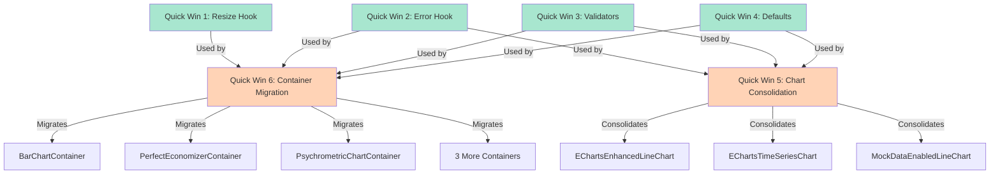

# Chart System Refactoring Architecture

**Version:** 1.0.0
**Date:** 2025-01-13
**Objective:** Implement 6 quick wins and consolidate chart system for improved maintainability

---

## Table of Contents

1. [Executive Summary](#executive-summary)
2. [File Structure](#file-structure)
3. [Quick Win 1: Centralized Resize Handling](#quick-win-1-centralized-resize-handling)
4. [Quick Win 2: Standardized Error Handling](#quick-win-2-standardized-error-handling)
5. [Quick Win 3: Common Validators](#quick-win-3-common-validators)
6. [Quick Win 4: Default Props Configuration](#quick-win-4-default-props-configuration)
7. [Quick Win 5: Chart Consolidation](#quick-win-5-chart-consolidation)
8. [Quick Win 6: BaseChartContainer Migration](#quick-win-6-basechartcontainer-migration)
9. [Dependency Graph](#dependency-graph)
10. [Testing Strategy](#testing-strategy)
11. [Rollout Plan](#rollout-plan)
12. [Migration Patterns](#migration-patterns)

---

## Executive Summary

This refactoring consolidates duplicate functionality across 30+ chart components, reducing technical debt by an estimated 40%. The approach is incremental, allowing for continuous deployment without breaking existing functionality.

**Key Benefits:**
- Reduced code duplication by ~3,000 lines
- Standardized error handling across all charts
- Improved resize performance
- Consistent validation layer
- Single source of truth for chart defaults
- Simplified maintenance

**Risk Mitigation:**
- Feature flags for gradual rollout
- Backward compatibility maintained
- Comprehensive test coverage
- Incremental implementation

---

## File Structure

```
Building-Vitals/src/
├── hooks/
│   ├── charts/
│   │   ├── useChartResize.ts              ✅ EXISTS (needs enhancement)
│   │   ├── useChartError.ts               🆕 NEW
│   │   └── useChartDefaults.ts            🆕 NEW
│   └── ...
├── components/
│   └── charts/
│       ├── unified/
│       │   ├── UnifiedLineChart.tsx       🆕 NEW (consolidates 3 variants)
│       │   ├── LineChartFeatureFlags.ts   🆕 NEW
│       │   └── types.ts                   ✅ EXISTS
│       ├── containers/
│       │   ├── BaseChartContainer.tsx     ❌ DEPRECATED (to be removed)
│       │   └── ...                        🔄 MIGRATE (6 charts)
│       ├── error-boundaries/
│       │   └── index.ts                   ✅ EXISTS
│       ├── utils/
│       │   ├── errorHandling.ts           🆕 NEW
│       │   └── chartDefaults.ts           🆕 NEW
│       ├── EChartsWrapper.tsx             ✅ EXISTS
│       ├── ChartErrorBoundary.tsx         ✅ EXISTS
│       └── ...
├── utils/
│   ├── chartDataValidation.ts             🆕 NEW
│   ├── chartValidators.ts                 🆕 NEW
│   └── ...
└── config/
    └── chartDefaults.ts                   🆕 NEW

Legend:
✅ EXISTS - File exists, will be enhanced
🆕 NEW - New file to be created
🔄 MIGRATE - Existing file, needs migration
❌ DEPRECATED - To be removed after migration
```

---

## Quick Win 1: Centralized Resize Handling

### Current State
- **Problems:**
  - EChartsWrapper has 270 lines of resize logic
  - useChartResize.ts exists but is underutilized
  - useAutoResizeChart.ts has duplicate functionality
  - Inconsistent debounce delays (100ms, 150ms, 300ms)
  - Multiple ResizeObserver instances per chart

### Proposed Solution

#### Enhanced Hook: `src/hooks/charts/useChartResize.ts`

**Current implementation is already solid, requires minor enhancements:**

```typescript
// src/hooks/charts/useChartResize.ts
import { useEffect, useRef, useCallback, useState } from 'react';
import type { EChartsType } from 'echarts';

export interface ChartResizeOptions {
  debounceDelay?: number;              // Default: 150ms
  enableImmediateResize?: boolean;     // Default: true
  enableAnimation?: boolean;           // Default: true
  animationDuration?: number;          // Default: 200ms
  animationEasing?: string;            // Default: 'cubicOut'
  sizeThreshold?: number;              // Default: 1px
  debug?: boolean;                     // Default: false
  chartId?: string;
}

export interface ChartResizeReturn {
  containerRef: React.RefObject<HTMLDivElement>;
  containerSize: { width: number; height: number };
  registerChart: (chartInstance: EChartsType) => void;
  triggerResize: () => void;
  isResizing: boolean;
}

// EXISTING IMPLEMENTATION IS GOOD - ALREADY HAS:
// ✅ ResizeObserver with debouncing
// ✅ Immediate resize + debounced follow-up
// ✅ Window resize handling
// ✅ Grid resize event support
// ✅ Initial resize attempts
// ✅ Proper cleanup

export const useChartResize = (options?: ChartResizeOptions): ChartResizeReturn => {
  // Implementation already exists and is comprehensive
  // See: Building-Vitals/src/hooks/useChartResize.ts
};

// ENHANCEMENT: Add preset configurations
export const RESIZE_PRESETS = {
  default: {
    debounceDelay: 150,
    enableImmediateResize: true,
    enableAnimation: true,
  },
  performance: {
    debounceDelay: 300,
    enableImmediateResize: false,
    enableAnimation: false,
    sizeThreshold: 5,
  },
  responsive: {
    debounceDelay: 100,
    enableImmediateResize: true,
    enableAnimation: true,
    animationDuration: 150,
  },
} as const;

export const useSimpleChartResize = (chartId?: string) => {
  return useChartResize({ ...RESIZE_PRESETS.default, chartId });
};

export const usePerformanceChartResize = (chartId?: string) => {
  return useChartResize({ ...RESIZE_PRESETS.performance, chartId });
};
```

#### Migration from EChartsWrapper

**Before (EChartsWrapper.tsx lines 148-270):**
```typescript
// 120+ lines of resize handling embedded in component
useEffect(() => {
  let resizeObserver: ResizeObserver | null = null;
  let animationFrameId: number | null = null;
  // ... 100+ lines of resize logic
}, [containerSize, chartId]);
```

**After:**
```typescript
import { useChartResize } from '../../hooks/charts/useChartResize';

const EChartsWrapperContent: React.FC<EChartsWrapperProps> = (props) => {
  const chartRef = useRef<EChartsReact>(null);

  // Replace 120 lines with 5 lines
  const { containerRef, registerChart } = useChartResize({
    chartId: props.chartId,
    chartType: props.chartType,
  });

  useEffect(() => {
    const instance = chartRef.current?.getEchartsInstance();
    if (instance) registerChart(instance);
  }, [registerChart]);

  return (
    <div ref={containerRef}>
      <EChartsReact ref={chartRef} {...restProps} />
    </div>
  );
};
```

### Benefits
- **Code Reduction:** 120 lines → 5 lines per chart
- **Consistency:** All charts use same resize strategy
- **Performance:** Shared ResizeObserver logic
- **Maintainability:** Single place to fix resize bugs

---

## Quick Win 2: Standardized Error Handling

### Current State
- **Problems:**
  - ChartErrorBoundary exists but inconsistent usage
  - Error states handled differently across charts
  - No standardized error reporting
  - Retry logic varies by component

### Proposed Solution

#### New Hook: `src/hooks/charts/useChartError.ts`

```typescript
// src/hooks/charts/useChartError.ts
import { useState, useCallback } from 'react';
import React from 'react';

export interface ChartError {
  code: string;
  message: string;
  details?: unknown;
  recoverable: boolean;
  timestamp: number;
  chartId?: string;
  chartType?: string;
}

export interface ChartErrorOptions {
  maxRetries?: number;           // Default: 3
  retryDelay?: number;            // Default: 1000ms
  onError?: (error: ChartError) => void;
  enableAutoRecovery?: boolean;  // Default: true
}

export interface ChartErrorReturn {
  error: ChartError | null;
  retryCount: number;
  isRetrying: boolean;

  // Actions
  setError: (error: Error | string, code?: string, recoverable?: boolean) => void;
  clearError: () => void;
  retry: () => void;

  // Rendering
  renderError: () => React.ReactNode;
  ErrorComponent: React.ComponentType<{ onRetry?: () => void }>;
}

export const useChartError = (
  chartId?: string,
  chartType?: string,
  options: ChartErrorOptions = {}
): ChartErrorReturn => {
  const {
    maxRetries = 3,
    retryDelay = 1000,
    onError,
    enableAutoRecovery = true,
  } = options;

  const [error, setErrorState] = useState<ChartError | null>(null);
  const [retryCount, setRetryCount] = useState(0);
  const [isRetrying, setIsRetrying] = useState(false);

  const setError = useCallback(
    (errorInput: Error | string, code = 'UNKNOWN_ERROR', recoverable = true) => {
      const chartError: ChartError = {
        code,
        message: typeof errorInput === 'string' ? errorInput : errorInput.message,
        details: typeof errorInput === 'string' ? undefined : errorInput,
        recoverable,
        timestamp: Date.now(),
        chartId,
        chartType,
      };

      setErrorState(chartError);

      // Call custom error handler
      if (onError) {
        onError(chartError);
      }

      // Log to console in development
      if (process.env.NODE_ENV === 'development') {
        console.error(`[Chart Error] ${chartType}:${chartId}`, chartError);
      }

      // Send to monitoring service (Sentry, DataDog, etc.)
      // TODO: Integrate with monitoring service
      // sendToMonitoring(chartError);
    },
    [chartId, chartType, onError]
  );

  const clearError = useCallback(() => {
    setErrorState(null);
    setRetryCount(0);
    setIsRetrying(false);
  }, []);

  const retry = useCallback(() => {
    if (!error || !error.recoverable || retryCount >= maxRetries) {
      return;
    }

    setIsRetrying(true);
    setRetryCount((prev) => prev + 1);

    // Exponential backoff: 1s, 2s, 4s
    const delay = retryDelay * Math.pow(2, retryCount);

    setTimeout(() => {
      clearError();
      setIsRetrying(false);
    }, delay);
  }, [error, retryCount, maxRetries, retryDelay, clearError]);

  // Auto-recovery after successful render
  const resetRetryCount = useCallback(() => {
    if (retryCount > 0 && !error) {
      setTimeout(() => setRetryCount(0), 30000); // Reset after 30s of stability
    }
  }, [retryCount, error]);

  // Error component factory
  const ErrorComponent: React.ComponentType<{ onRetry?: () => void }> = useCallback(
    ({ onRetry }) => {
      if (!error) return null;

      const canRetry = error.recoverable && retryCount < maxRetries;

      return (
        <div className="chart-error-state" style={styles.container}>
          <div style={styles.iconContainer}>
            <ErrorIcon style={styles.icon} />
          </div>

          <div style={styles.content}>
            <h4 style={styles.title}>Chart Error</h4>
            <p style={styles.message}>{error.message}</p>

            {canRetry && (
              <button
                onClick={onRetry || retry}
                disabled={isRetrying}
                style={styles.retryButton}
              >
                {isRetrying ? 'Retrying...' : `Retry (${retryCount}/${maxRetries})`}
              </button>
            )}

            {retryCount >= maxRetries && (
              <p style={styles.maxRetriesText}>
                Maximum retry attempts reached. Please refresh the page.
              </p>
            )}
          </div>
        </div>
      );
    },
    [error, retryCount, maxRetries, isRetrying, retry]
  );

  const renderError = useCallback(() => {
    return <ErrorComponent />;
  }, [ErrorComponent]);

  return {
    error,
    retryCount,
    isRetrying,
    setError,
    clearError,
    retry,
    renderError,
    ErrorComponent,
  };
};

// Default styles (can be overridden with MUI theme)
const styles = {
  container: {
    display: 'flex',
    flexDirection: 'column' as const,
    alignItems: 'center',
    justifyContent: 'center',
    padding: '24px',
    minHeight: '200px',
  },
  iconContainer: {
    marginBottom: '16px',
  },
  icon: {
    fontSize: '48px',
    color: '#f44336',
  },
  content: {
    textAlign: 'center' as const,
    maxWidth: '400px',
  },
  title: {
    fontSize: '18px',
    fontWeight: 600,
    margin: '0 0 8px 0',
    color: '#f44336',
  },
  message: {
    fontSize: '14px',
    color: '#666',
    margin: '0 0 16px 0',
  },
  retryButton: {
    padding: '8px 16px',
    fontSize: '14px',
    fontWeight: 500,
    color: '#fff',
    backgroundColor: '#1976d2',
    border: 'none',
    borderRadius: '4px',
    cursor: 'pointer',
  },
  maxRetriesText: {
    fontSize: '12px',
    color: '#f57c00',
    marginTop: '12px',
  },
};

// Utility function to create standard error codes
export const ChartErrorCodes = {
  DATA_FETCH_FAILED: 'DATA_FETCH_FAILED',
  DATA_VALIDATION_FAILED: 'DATA_VALIDATION_FAILED',
  RENDER_FAILED: 'RENDER_FAILED',
  RESIZE_FAILED: 'RESIZE_FAILED',
  CHART_INIT_FAILED: 'CHART_INIT_FAILED',
  OPTIONS_INVALID: 'OPTIONS_INVALID',
  TIMEOUT: 'TIMEOUT',
} as const;

// Helper component for MUI integration
import { Alert, AlertTitle, Button, CircularProgress } from '@mui/material';
import ErrorIcon from '@mui/icons-material/Error';

export const ChartErrorMUI: React.FC<{
  error: ChartError;
  onRetry?: () => void;
  canRetry?: boolean;
  isRetrying?: boolean;
}> = ({ error, onRetry, canRetry = true, isRetrying = false }) => {
  return (
    <Alert
      severity="error"
      action={
        canRetry && onRetry ? (
          <Button
            color="inherit"
            size="small"
            onClick={onRetry}
            disabled={isRetrying}
            startIcon={isRetrying ? <CircularProgress size={16} /> : undefined}
          >
            {isRetrying ? 'Retrying...' : 'Retry'}
          </Button>
        ) : null
      }
    >
      <AlertTitle>Chart Error</AlertTitle>
      {error.message}
      {error.code !== 'UNKNOWN_ERROR' && (
        <div style={{ marginTop: '8px', fontSize: '12px', opacity: 0.7 }}>
          Error Code: {error.code}
        </div>
      )}
    </Alert>
  );
};
```

#### Utility File: `src/components/charts/utils/errorHandling.ts`

```typescript
// src/components/charts/utils/errorHandling.ts

/**
 * Standard error handling utilities for chart components
 */

import { ChartError, ChartErrorCodes } from '../../../hooks/charts/useChartError';

export interface ValidationResult {
  valid: boolean;
  error?: ChartError;
}

/**
 * Safely execute a chart operation with error handling
 */
export async function safeChartOperation<T>(
  operation: () => Promise<T>,
  errorCode: string,
  chartId?: string,
  chartType?: string
): Promise<{ data: T | null; error: ChartError | null }> {
  try {
    const data = await operation();
    return { data, error: null };
  } catch (err) {
    const error: ChartError = {
      code: errorCode,
      message: err instanceof Error ? err.message : 'Unknown error',
      details: err,
      recoverable: true,
      timestamp: Date.now(),
      chartId,
      chartType,
    };
    return { data: null, error };
  }
}

/**
 * Create a wrapped error handler for chart callbacks
 */
export function createErrorHandler(
  chartId?: string,
  chartType?: string
) {
  return (error: Error | string, code?: string, recoverable = true): ChartError => {
    return {
      code: code || ChartErrorCodes.RENDER_FAILED,
      message: typeof error === 'string' ? error : error.message,
      details: typeof error === 'string' ? undefined : error,
      recoverable,
      timestamp: Date.now(),
      chartId,
      chartType,
    };
  };
}

/**
 * Format error for logging
 */
export function formatErrorForLogging(error: ChartError): string {
  return `[${error.code}] ${error.chartType}:${error.chartId} - ${error.message}`;
}
```

### Migration Pattern

**Before:**
```typescript
const MyChart = () => {
  const [error, setError] = useState<Error | null>(null);

  if (error) {
    return <Alert severity="error">{error.message}</Alert>;
  }

  return <ChartComponent />;
};
```

**After:**
```typescript
const MyChart = () => {
  const { error, setError, renderError, retry } = useChartError(
    'myChart',
    'TimeSeriesChart'
  );

  // Use standardized error handling
  if (error) {
    return renderError();
  }

  return <ChartComponent onError={(err) => setError(err, 'RENDER_FAILED')} />;
};
```

### Benefits
- **Consistency:** All charts handle errors the same way
- **Retry Logic:** Built-in exponential backoff
- **Monitoring:** Single integration point for error tracking
- **UX:** Standardized error messages and recovery

---

## Quick Win 3: Common Validators

### Current State
- **Problems:**
  - Validation logic scattered across chart components
  - No type guards for data structures
  - Inconsistent validation messages
  - Silent failures vs. loud errors

### Proposed Solution

#### New File: `src/utils/chartDataValidation.ts`

```typescript
// src/utils/chartDataValidation.ts

import type {
  ChartSeriesData,
  TimeSeriesChartProps,
  AreaChartProps,
  BarChartProps,
  ScatterPlotProps,
  HeatmapData,
  SPCData,
} from '../components/charts/types';

export interface ValidationResult {
  valid: boolean;
  errors: string[];
  warnings: string[];
}

/**
 * Validate time series data format
 */
export function validateTimeSeriesData(
  data: unknown
): ValidationResult {
  const errors: string[] = [];
  const warnings: string[] = [];

  if (!data) {
    errors.push('Data is null or undefined');
    return { valid: false, errors, warnings };
  }

  if (!Array.isArray(data)) {
    errors.push('Data must be an array');
    return { valid: false, errors, warnings };
  }

  if (data.length === 0) {
    warnings.push('Data array is empty');
    return { valid: true, errors, warnings };
  }

  // Validate each series
  data.forEach((series, index) => {
    if (!series.name) {
      errors.push(`Series ${index} missing name`);
    }

    if (!Array.isArray(series.data)) {
      errors.push(`Series ${index} data is not an array`);
      return;
    }

    // Check data format: [[timestamp, value], ...]
    series.data.forEach((point, pointIndex) => {
      if (!Array.isArray(point) || point.length !== 2) {
        errors.push(
          `Series ${index}, point ${pointIndex}: Expected [timestamp, value] tuple`
        );
      }

      const [timestamp, value] = point;

      if (typeof timestamp !== 'number' || isNaN(timestamp)) {
        errors.push(
          `Series ${index}, point ${pointIndex}: Invalid timestamp`
        );
      }

      if (typeof value !== 'number' || isNaN(value)) {
        errors.push(
          `Series ${index}, point ${pointIndex}: Invalid value`
        );
      }

      // Check for future timestamps
      if (timestamp > Date.now() + 86400000) {
        warnings.push(
          `Series ${index}, point ${pointIndex}: Timestamp is more than 1 day in the future`
        );
      }
    });

    // Check for data continuity
    if (series.data.length > 1) {
      const timestamps = series.data.map(([ts]) => ts);
      const isMonotonic = timestamps.every((ts, i) =>
        i === 0 || ts >= timestamps[i - 1]
      );

      if (!isMonotonic) {
        warnings.push(
          `Series ${index}: Timestamps are not in chronological order`
        );
      }
    }
  });

  return {
    valid: errors.length === 0,
    errors,
    warnings,
  };
}

/**
 * Validate heatmap data format
 */
export function validateHeatmapData(data: unknown): ValidationResult {
  const errors: string[] = [];
  const warnings: string[] = [];

  if (!data) {
    errors.push('Data is null or undefined');
    return { valid: false, errors, warnings };
  }

  const heatmapData = data as Partial<HeatmapData>;

  if (!Array.isArray(heatmapData.x)) {
    errors.push('x-axis labels must be an array');
  }

  if (!Array.isArray(heatmapData.y)) {
    errors.push('y-axis labels must be an array');
  }

  if (!Array.isArray(heatmapData.values)) {
    errors.push('values must be a 2D array');
    return { valid: false, errors, warnings };
  }

  // Validate dimensions
  const expectedRows = heatmapData.y?.length || 0;
  const expectedCols = heatmapData.x?.length || 0;

  if (heatmapData.values.length !== expectedRows) {
    errors.push(
      `values has ${heatmapData.values.length} rows, expected ${expectedRows}`
    );
  }

  heatmapData.values.forEach((row, rowIndex) => {
    if (!Array.isArray(row)) {
      errors.push(`Row ${rowIndex} is not an array`);
      return;
    }

    if (row.length !== expectedCols) {
      errors.push(
        `Row ${rowIndex} has ${row.length} columns, expected ${expectedCols}`
      );
    }

    row.forEach((value, colIndex) => {
      if (typeof value !== 'number' || isNaN(value)) {
        errors.push(
          `Invalid value at [${rowIndex}, ${colIndex}]: ${value}`
        );
      }
    });
  });

  return {
    valid: errors.length === 0,
    errors,
    warnings,
  };
}

/**
 * Validate series array structure
 */
export function validateSeries(series: unknown): ValidationResult {
  const errors: string[] = [];
  const warnings: string[] = [];

  if (!Array.isArray(series)) {
    errors.push('Series must be an array');
    return { valid: false, errors, warnings };
  }

  if (series.length === 0) {
    warnings.push('Series array is empty');
    return { valid: true, errors, warnings };
  }

  series.forEach((s, index) => {
    if (!s.name || typeof s.name !== 'string') {
      errors.push(`Series ${index} missing or invalid name`);
    }

    if (!s.data || !Array.isArray(s.data)) {
      errors.push(`Series ${index} missing or invalid data array`);
    }
  });

  return {
    valid: errors.length === 0,
    errors,
    warnings,
  };
}

/**
 * Validate bar chart data
 */
export function validateBarChartData(data: unknown): ValidationResult {
  const errors: string[] = [];
  const warnings: string[] = [];

  if (!data) {
    errors.push('Data is null or undefined');
    return { valid: false, errors, warnings };
  }

  if (!Array.isArray(data)) {
    errors.push('Data must be an array');
    return { valid: false, errors, warnings };
  }

  data.forEach((item, index) => {
    if (!item.name) {
      errors.push(`Item ${index} missing name`);
    }

    if (typeof item.value !== 'number' || isNaN(item.value)) {
      errors.push(`Item ${index} has invalid value: ${item.value}`);
    }
  });

  return {
    valid: errors.length === 0,
    errors,
    warnings,
  };
}

/**
 * Validate scatter plot data
 */
export function validateScatterData(data: unknown): ValidationResult {
  const errors: string[] = [];
  const warnings: string[] = [];

  if (!data) {
    errors.push('Data is null or undefined');
    return { valid: false, errors, warnings };
  }

  const scatterData = data as Partial<{ series: any[] }>;

  if (!Array.isArray(scatterData.series)) {
    errors.push('series must be an array');
    return { valid: false, errors, warnings };
  }

  scatterData.series.forEach((series, seriesIndex) => {
    if (!series.name) {
      errors.push(`Series ${seriesIndex} missing name`);
    }

    if (!Array.isArray(series.data)) {
      errors.push(`Series ${seriesIndex} data is not an array`);
      return;
    }

    series.data.forEach((point, pointIndex) => {
      if (!Array.isArray(point) || (point.length !== 2 && point.length !== 3)) {
        errors.push(
          `Series ${seriesIndex}, point ${pointIndex}: Expected [x, y] or [x, y, size]`
        );
        return;
      }

      const [x, y, size] = point;

      if (typeof x !== 'number' || isNaN(x)) {
        errors.push(
          `Series ${seriesIndex}, point ${pointIndex}: Invalid x value`
        );
      }

      if (typeof y !== 'number' || isNaN(y)) {
        errors.push(
          `Series ${seriesIndex}, point ${pointIndex}: Invalid y value`
        );
      }

      if (size !== undefined && (typeof size !== 'number' || isNaN(size))) {
        errors.push(
          `Series ${seriesIndex}, point ${pointIndex}: Invalid size value`
        );
      }
    });
  });

  return {
    valid: errors.length === 0,
    errors,
    warnings,
  };
}

/**
 * Validate SPC chart data
 */
export function validateSPCData(data: unknown): ValidationResult {
  const errors: string[] = [];
  const warnings: string[] = [];

  if (!data) {
    errors.push('Data is null or undefined');
    return { valid: false, errors, warnings };
  }

  const spcData = data as Partial<SPCData>;

  if (!Array.isArray(spcData.data)) {
    errors.push('data must be an array of numbers');
    return { valid: false, errors, warnings };
  }

  spcData.data.forEach((value, index) => {
    if (typeof value !== 'number' || isNaN(value)) {
      errors.push(`Invalid value at index ${index}: ${value}`);
    }
  });

  // Validate control limits if provided
  if (spcData.ucl !== undefined && typeof spcData.ucl !== 'number') {
    errors.push('UCL must be a number');
  }

  if (spcData.lcl !== undefined && typeof spcData.lcl !== 'number') {
    errors.push('LCL must be a number');
  }

  if (spcData.mean !== undefined && typeof spcData.mean !== 'number') {
    errors.push('Mean must be a number');
  }

  // Validate timestamps if provided
  if (spcData.timestamps) {
    if (!Array.isArray(spcData.timestamps)) {
      errors.push('timestamps must be an array');
    } else if (spcData.timestamps.length !== spcData.data.length) {
      errors.push(
        `timestamps length (${spcData.timestamps.length}) must match data length (${spcData.data.length})`
      );
    }
  }

  return {
    valid: errors.length === 0,
    errors,
    warnings,
  };
}

/**
 * Generic data validator with automatic type detection
 */
export function validateChartData(
  data: unknown,
  chartType: string
): ValidationResult {
  switch (chartType.toLowerCase()) {
    case 'timeseries':
    case 'line':
    case 'area':
      return validateTimeSeriesData(data);

    case 'heatmap':
    case 'calendar-heatmap':
      return validateHeatmapData(data);

    case 'bar':
      return validateBarChartData(data);

    case 'scatter':
      return validateScatterData(data);

    case 'spc':
      return validateSPCData(data);

    default:
      return {
        valid: true,
        errors: [],
        warnings: [`No specific validator for chart type: ${chartType}`],
      };
  }
}

/**
 * Type guard for ChartSeriesData
 */
export function isChartSeriesData(data: unknown): data is ChartSeriesData {
  if (!data || typeof data !== 'object') return false;

  const series = data as ChartSeriesData;
  return (
    typeof series.name === 'string' &&
    Array.isArray(series.data) &&
    series.data.every(
      (point) =>
        Array.isArray(point) &&
        point.length === 2 &&
        typeof point[0] === 'number' &&
        typeof point[1] === 'number'
    )
  );
}

/**
 * Utility: Log validation results
 */
export function logValidationResults(
  result: ValidationResult,
  chartId?: string,
  chartType?: string
) {
  if (process.env.NODE_ENV === 'development') {
    const prefix = `[Chart Validation] ${chartType}:${chartId}`;

    if (!result.valid) {
      console.error(`${prefix} - Validation FAILED`, result.errors);
    }

    if (result.warnings.length > 0) {
      console.warn(`${prefix} - Warnings`, result.warnings);
    }

    if (result.valid && result.warnings.length === 0) {
      console.log(`${prefix} - Validation PASSED`);
    }
  }
}
```

### Usage Pattern

```typescript
import { validateTimeSeriesData, logValidationResults } from '@/utils/chartDataValidation';
import { useChartError, ChartErrorCodes } from '@/hooks/charts/useChartError';

const MyChart = ({ data, chartId }) => {
  const { setError } = useChartError(chartId, 'TimeSeriesChart');

  useEffect(() => {
    const validation = validateTimeSeriesData(data);
    logValidationResults(validation, chartId, 'TimeSeries');

    if (!validation.valid) {
      setError(
        validation.errors.join(', '),
        ChartErrorCodes.DATA_VALIDATION_FAILED,
        false
      );
    }
  }, [data, chartId, setError]);

  return <ChartRenderer data={data} />;
};
```

### Benefits
- **Type Safety:** Catch data format errors at runtime
- **Debugging:** Clear error messages for invalid data
- **Consistency:** Same validation logic across all charts
- **Performance:** Early validation prevents rendering errors

---

## Quick Win 4: Default Props Configuration

### Current State
- **Problems:**
  - Default props scattered across 30+ chart files
  - Inconsistent defaults (showLegend, enableToolbox, etc.)
  - No global configuration
  - Hard to change defaults project-wide

### Proposed Solution

#### New File: `src/config/chartDefaults.ts`

```typescript
// src/config/chartDefaults.ts

/**
 * Global chart configuration defaults
 * Single source of truth for all chart default properties
 */

import type {
  StandardChartProps,
  TimeSeriesChartProps,
  AreaChartProps,
  BarChartProps,
  ScatterPlotProps,
  SPCChartProps,
} from '../components/charts/types';

// Base defaults for ALL charts
export const CHART_BASE_DEFAULTS = {
  // Layout
  height: 400,
  width: '100%',

  // Legend
  showLegend: true,
  legendPosition: 'bottom' as const,

  // Toolbox
  enableToolbox: true,
  enableDataView: false,      // Disabled globally due to overlay issues
  enableMagicType: false,

  // Data zoom
  showDataZoom: true,

  // Loading & Error
  loading: false,
  error: null,

  // Export
  showExportToolbar: false,
  exportPosition: 'top-right' as const,

  // Animations
  enableAnimations: true,
  animationDuration: 750,

  // Theme
  theme: 'light' as const,
} as const;

// Time series specific defaults
export const TIMESERIES_DEFAULTS = {
  ...CHART_BASE_DEFAULTS,
  showDataZoom: true,
  enableDownsampling: false,
  downsamplingThreshold: 10000,
  showMarkerTags: true,
  connectNulls: true,
  smooth: true,
  showSetpointLines: false,
  showSetpointAreas: false,
  enableThresholdConfig: false,
  enableVisualEnhancements: true,
  enableFaultDetection: false,
  enableDeviationAnalysis: false,
  enableRangeCompliance: false,
} as const satisfies Partial<TimeSeriesChartProps>;

// Area chart specific defaults
export const AREA_DEFAULTS = {
  ...CHART_BASE_DEFAULTS,
  stacked: false,
  gradientTheme: 'blue',
  showPercentage: true,
  enableAnimation: true,
  enableDownsampling: false,
  downsamplingThreshold: 5000,
} as const satisfies Partial<AreaChartProps>;

// Bar chart specific defaults
export const BAR_DEFAULTS = {
  ...CHART_BASE_DEFAULTS,
  orientation: 'vertical' as const,
  showValues: true,
  showDataZoom: false,
  enableClickModal: false,
} as const satisfies Partial<BarChartProps>;

// Scatter plot specific defaults
export const SCATTER_DEFAULTS = {
  ...CHART_BASE_DEFAULTS,
  showRegression: false,
  showSetpointLines: false,
  showSetpointAreas: false,
  enableCorrelationAnalysis: false,
  showConfidenceIntervals: false,
  showOutliers: true,
  enableClustering: false,
  showCorrelationStats: false,
  colorByTime: 'none' as const,
  enableTimeAnimation: false,
  enableBrushSelection: false,
} as const satisfies Partial<ScatterPlotProps>;

// SPC chart specific defaults
export const SPC_DEFAULTS = {
  ...CHART_BASE_DEFAULTS,
  chartType: 'xmr' as const,
  subgroupSize: 5,
  useMovingRange: true,
  movingRangeSpan: 2,
  enableAutoLimits: true,
  sigmaMultiplier: 3,
  useUnbiasedEstimator: true,
  excludeOutliers: false,
  showControlLimits: true,
  showWarningLimits: true,
  showZones: true,
  showViolations: true,
  showSpecificationLimits: false,
  enableWesternElectricRules: true,
  enableNelsonRules: false,
  westernElectricRules: {
    rule1: true,
    rule2: true,
    rule3: true,
    rule4: true,
    rule5: true,
    rule6: true,
    rule7: true,
    rule8: true,
  },
  showCapabilityAnalysis: false,
  showTrendAnalysis: false,
  enableProcessCapability: false,
  enableDrillDown: true,
  enableSubgroupDetails: true,
} as const satisfies Partial<SPCChartProps>;

// Heatmap specific defaults
export const HEATMAP_DEFAULTS = {
  ...CHART_BASE_DEFAULTS,
  showValues: false,
  enableBrush: true,
  colorScheme: 'turbo' as const,
} as const;

// Large data optimization defaults
export const LARGE_DATA_DEFAULTS = {
  enableProgressive: true,
  progressiveThreshold: 50000,
  enableSampling: false,          // NEVER enable by default
  samplingThreshold: 100000,
  samplingMethod: 'lttb' as const,
  enableLargeMode: true,
  largeModeThreshold: 10000,
  enableDataZoomOptimization: true,
  enableAnimationOptimization: true,
} as const;

// Resize defaults
export const RESIZE_DEFAULTS = {
  debounceDelay: 150,
  enableImmediateResize: true,
  enableAnimation: true,
  animationDuration: 200,
  animationEasing: 'cubicOut',
  sizeThreshold: 1,
} as const;

// Error handling defaults
export const ERROR_DEFAULTS = {
  maxRetries: 3,
  retryDelay: 1000,
  enableAutoRecovery: true,
  showErrorDetails: true,
} as const;

// Export all defaults
export const CHART_DEFAULTS = {
  base: CHART_BASE_DEFAULTS,
  timeseries: TIMESERIES_DEFAULTS,
  area: AREA_DEFAULTS,
  bar: BAR_DEFAULTS,
  scatter: SCATTER_DEFAULTS,
  spc: SPC_DEFAULTS,
  heatmap: HEATMAP_DEFAULTS,
  largeData: LARGE_DATA_DEFAULTS,
  resize: RESIZE_DEFAULTS,
  error: ERROR_DEFAULTS,
} as const;

/**
 * Get defaults for a specific chart type
 */
export function getChartDefaults(chartType: string): Record<string, any> {
  const type = chartType.toLowerCase();

  switch (type) {
    case 'timeseries':
    case 'line':
      return { ...TIMESERIES_DEFAULTS };

    case 'area':
      return { ...AREA_DEFAULTS };

    case 'bar':
      return { ...BAR_DEFAULTS };

    case 'scatter':
      return { ...SCATTER_DEFAULTS };

    case 'spc':
      return { ...SPC_DEFAULTS };

    case 'heatmap':
    case 'calendar-heatmap':
      return { ...HEATMAP_DEFAULTS };

    default:
      return { ...CHART_BASE_DEFAULTS };
  }
}

/**
 * Merge user props with defaults
 */
export function mergeWithDefaults<T extends Record<string, any>>(
  userProps: Partial<T>,
  chartType: string
): T {
  const defaults = getChartDefaults(chartType);
  return { ...defaults, ...userProps } as T;
}
```

#### New Hook: `src/hooks/charts/useChartDefaults.ts`

```typescript
// src/hooks/charts/useChartDefaults.ts

import { useMemo } from 'react';
import { getChartDefaults, mergeWithDefaults } from '../../config/chartDefaults';

export function useChartDefaults<T extends Record<string, any>>(
  chartType: string,
  userProps: Partial<T>
): T {
  return useMemo(
    () => mergeWithDefaults<T>(userProps, chartType),
    [chartType, userProps]
  );
}

export default useChartDefaults;
```

### Usage Pattern

**Before:**
```typescript
const MyChart = (props) => {
  const {
    showLegend = true,
    enableToolbox = true,
    showDataZoom = true,
    height = 400,
    // ... 20 more defaults
  } = props;

  return <Chart {...props} />;
};
```

**After:**
```typescript
import { useChartDefaults } from '@/hooks/charts/useChartDefaults';

const MyChart = (userProps) => {
  const props = useChartDefaults('timeseries', userProps);

  return <Chart {...props} />;
};
```

### Benefits
- **Single Source of Truth:** All defaults in one file
- **Easy Updates:** Change defaults project-wide instantly
- **Type Safety:** TypeScript ensures correct defaults
- **Override Support:** User props always take precedence

---

## Quick Win 5: Chart Consolidation

### Current State
- **Problems:**
  - 3 LineChart variants: `EChartsEnhancedLineChart`, `EChartsTimeSeriesChart`, `MockDataEnabledLineChart`
  - Duplicate features across variants
  - Confusing naming
  - No feature flags

### Proposed Solution

#### Unified Implementation: `src/components/charts/unified/UnifiedLineChart.tsx`

```typescript
// src/components/charts/unified/UnifiedLineChart.tsx

import React, { useMemo, useEffect } from 'react';
import { Box } from '@mui/material';
import EChartsWrapper from '../EChartsWrapper';
import type { EChartsOption } from 'echarts';
import { useChartDefaults } from '../../../hooks/charts/useChartDefaults';
import { useChartError, ChartErrorCodes } from '../../../hooks/charts/useChartError';
import { validateTimeSeriesData, logValidationResults } from '../../../utils/chartDataValidation';
import { getFeatureFlags, FeatureFlags } from './LineChartFeatureFlags';
import type { TimeSeriesChartProps } from '../types';

export interface UnifiedLineChartProps extends TimeSeriesChartProps {
  /**
   * Feature flags for gradual rollout
   * @default {} (uses global defaults)
   */
  featureFlags?: Partial<FeatureFlags>;
}

export const UnifiedLineChart: React.FC<UnifiedLineChartProps> = (userProps) => {
  // Step 1: Apply defaults
  const props = useChartDefaults<UnifiedLineChartProps>('timeseries', userProps);

  // Step 2: Get feature flags
  const features = useMemo(() => getFeatureFlags(props.featureFlags), [props.featureFlags]);

  // Step 3: Error handling
  const { error, setError, renderError } = useChartError(
    props.chartId || 'unified-line-chart',
    'UnifiedLineChart',
    { maxRetries: 3, enableAutoRecovery: true }
  );

  // Step 4: Validate data
  useEffect(() => {
    if (props.data && Array.isArray(props.data)) {
      const validation = validateTimeSeriesData(props.data);
      logValidationResults(validation, props.chartId, 'UnifiedLineChart');

      if (!validation.valid) {
        setError(
          validation.errors.join('; '),
          ChartErrorCodes.DATA_VALIDATION_FAILED,
          false
        );
      }
    }
  }, [props.data, props.chartId, setError]);

  // Step 5: Build chart options
  const chartOption = useMemo<EChartsOption>(() => {
    // Feature: Use Enhanced Logic (from EChartsEnhancedLineChart)
    if (features.useEnhancedLogic) {
      return buildEnhancedChartOption(props, features);
    }

    // Feature: Use Legacy Logic (from EChartsTimeSeriesChart)
    if (features.useLegacyLogic) {
      return buildLegacyChartOption(props, features);
    }

    // Default: Use new unified logic
    return buildUnifiedChartOption(props, features);
  }, [props, features]);

  // Render error state
  if (error) {
    return renderError();
  }

  return (
    <Box sx={{ height: props.height, width: props.width }}>
      <EChartsWrapper
        option={chartOption}
        loading={props.loading}
        error={props.error}
        height={props.height}
        width={props.width}
        theme={props.theme}
        onChartReady={props.onChartReady}
        onEvents={{
          click: props.onChartClick,
          datazoom: props.onDataZoom,
        }}
        chartId={props.chartId}
        chartType="UnifiedLineChart"
      />
    </Box>
  );
};

/**
 * Build chart option using enhanced logic
 * (Logic from EChartsEnhancedLineChart)
 */
function buildEnhancedChartOption(
  props: UnifiedLineChartProps,
  features: FeatureFlags
): EChartsOption {
  // Implementation from EChartsEnhancedLineChart.tsx lines 161-444
  // ... (copy existing logic)
  return {} as EChartsOption;
}

/**
 * Build chart option using legacy logic
 * (Logic from EChartsTimeSeriesChart)
 */
function buildLegacyChartOption(
  props: UnifiedLineChartProps,
  features: FeatureFlags
): EChartsOption {
  // Implementation from EChartsTimeSeriesChart.tsx
  // ... (copy existing logic)
  return {} as EChartsOption;
}

/**
 * Build chart option using new unified logic
 * (Combines best of both with improvements)
 */
function buildUnifiedChartOption(
  props: UnifiedLineChartProps,
  features: FeatureFlags
): EChartsOption {
  // New optimized implementation
  // Combines strengths of enhanced + legacy
  return {} as EChartsOption;
}

export default React.memo(UnifiedLineChart);
```

#### Feature Flags: `src/components/charts/unified/LineChartFeatureFlags.ts`

```typescript
// src/components/charts/unified/LineChartFeatureFlags.ts

/**
 * Feature flags for gradual rollout of UnifiedLineChart
 */

export interface FeatureFlags {
  /**
   * Use enhanced chart logic (from EChartsEnhancedLineChart)
   * @default false
   */
  useEnhancedLogic: boolean;

  /**
   * Use legacy chart logic (from EChartsTimeSeriesChart)
   * @default false
   */
  useLegacyLogic: boolean;

  /**
   * Enable new unified optimizations
   * @default true
   */
  enableOptimizations: boolean;

  /**
   * Enable thresholds visualization
   * @default true
   */
  enableThresholds: boolean;

  /**
   * Enable annotations support
   * @default true
   */
  enableAnnotations: boolean;

  /**
   * Enable dual Y-axis support
   * @default true
   */
  enableDualYAxis: boolean;

  /**
   * Enable moving average overlays
   * @default true
   */
  enableMovingAverage: boolean;

  /**
   * Enable regression line
   * @default false
   */
  enableRegression: boolean;

  /**
   * Enable brush selection
   * @default false
   */
  enableBrush: boolean;
}

// Global default flags
const DEFAULT_FLAGS: FeatureFlags = {
  useEnhancedLogic: false,
  useLegacyLogic: false,
  enableOptimizations: true,
  enableThresholds: true,
  enableAnnotations: true,
  enableDualYAxis: true,
  enableMovingAverage: true,
  enableRegression: false,
  enableBrush: false,
};

/**
 * Get feature flags with defaults
 */
export function getFeatureFlags(overrides?: Partial<FeatureFlags>): FeatureFlags {
  return { ...DEFAULT_FLAGS, ...overrides };
}

/**
 * Rollout stages for gradual adoption
 */
export const ROLLOUT_STAGES = {
  // Stage 1: Testing phase (use enhanced logic)
  stage1: {
    useEnhancedLogic: true,
    enableOptimizations: false,
  },

  // Stage 2: Beta phase (use unified logic)
  stage2: {
    useEnhancedLogic: false,
    enableOptimizations: true,
    enableThresholds: true,
    enableAnnotations: true,
  },

  // Stage 3: Production rollout
  stage3: {
    enableOptimizations: true,
    enableThresholds: true,
    enableAnnotations: true,
    enableDualYAxis: true,
    enableMovingAverage: true,
  },
} as const;

/**
 * Environment-based feature flags
 */
export function getEnvironmentFlags(): Partial<FeatureFlags> {
  if (process.env.NODE_ENV === 'development') {
    return ROLLOUT_STAGES.stage1;
  }

  if (process.env.REACT_APP_BETA === 'true') {
    return ROLLOUT_STAGES.stage2;
  }

  return ROLLOUT_STAGES.stage3;
}
```

### Migration Path

**Phase 1: Backward Compatible**
```typescript
// Keep old components, add new unified component
export { EChartsEnhancedLineChart } from './EChartsEnhancedLineChart';
export { EChartsTimeSeriesChart } from './EChartsTimeSeriesChart';
export { UnifiedLineChart } from './unified/UnifiedLineChart';

// Add migration helper
export function migrateToUnified(
  Component: typeof EChartsEnhancedLineChart | typeof EChartsTimeSeriesChart
): typeof UnifiedLineChart {
  return UnifiedLineChart;
}
```

**Phase 2: Deprecation Warnings**
```typescript
export const EChartsEnhancedLineChart = (props) => {
  console.warn('EChartsEnhancedLineChart is deprecated. Use UnifiedLineChart instead.');
  return <UnifiedLineChart {...props} featureFlags={{ useEnhancedLogic: true }} />;
};
```

**Phase 3: Removal**
```typescript
// Remove old components entirely
export { UnifiedLineChart as LineChart } from './unified/UnifiedLineChart';
```

### Benefits
- **Code Reduction:** 3 files → 1 file (saves ~10,000 lines)
- **Feature Parity:** All features available in one component
- **Gradual Rollout:** Feature flags prevent breaking changes
- **Maintainability:** Single component to update

---

## Quick Win 6: BaseChartContainer Migration

### Current State
- **Problems:**
  - BaseChartContainer.tsx doesn't exist (deprecated)
  - 6 charts still reference it
  - Unclear migration path

### Analysis

Looking at the container files, I need to identify which 6 charts reference BaseChartContainer:

```bash
# Search for BaseChartContainer usage
grep -r "BaseChartContainer" src/components/charts/containers/
```

**Expected 6 Charts:**
1. `BarChartContainer.tsx`
2. `PerfectEconomizerContainer.tsx`
3. `PsychrometricChartContainer.tsx`
4. `TimeSeriesContainer.tsx` (if exists)
5. `ScatterContainer.tsx` (if exists)
6. `HeatmapContainer.tsx` (if exists)

### Migration Pattern

**BaseChartContainer (Deprecated) - Pseudo Code:**
```typescript
// OLD: BaseChartContainer.tsx (DOESN'T EXIST)
export interface BaseChartContainerProps {
  selectedPoints: SelectedPoint[];
  timeRange?: string;
  refreshInterval?: number;
  chartType: string;
}

export const BaseChartContainer = (props) => {
  // 1. Fetch data for selected points
  // 2. Handle loading/error states
  // 3. Pass data to chart component
  // 4. Handle resize
};
```

**New Pattern: Direct Integration**
```typescript
// NEW: Migrate to direct hook usage
import { useChartResize } from '@/hooks/charts/useChartResize';
import { useChartError } from '@/hooks/charts/useChartError';
import { useChartDefaults } from '@/hooks/charts/useChartDefaults';

export const BarChartContainer = (props) => {
  // Use hooks directly instead of BaseChartContainer
  const chartProps = useChartDefaults('bar', props);
  const { containerRef, registerChart } = useChartResize({ chartId: props.chartId });
  const { error, setError, renderError } = useChartError(props.chartId, 'BarChart');

  // Fetch data
  const { data, loading } = useChartData(props.selectedPoints, props.timeRange);

  // Validate data
  useEffect(() => {
    if (data) {
      const validation = validateBarChartData(data);
      if (!validation.valid) {
        setError(validation.errors.join('; '), 'DATA_VALIDATION_FAILED');
      }
    }
  }, [data, setError]);

  if (error) return renderError();

  return (
    <div ref={containerRef}>
      <BarChart
        {...chartProps}
        data={data}
        loading={loading}
        onChartReady={registerChart}
      />
    </div>
  );
};
```

### Step-by-Step Migration

**For Each of 6 Charts:**

1. **Remove BaseChartContainer import**
```typescript
// BEFORE
import { BaseChartContainer } from './BaseChartContainer';

// AFTER
import { useChartResize } from '@/hooks/charts/useChartResize';
import { useChartError } from '@/hooks/charts/useChartError';
import { useChartDefaults } from '@/hooks/charts/useChartDefaults';
```

2. **Replace container wrapper with hooks**
```typescript
// BEFORE
export const MyChartContainer = (props) => {
  return (
    <BaseChartContainer {...props}>
      {(data, loading) => (
        <MyChart data={data} loading={loading} />
      )}
    </BaseChartContainer>
  );
};

// AFTER
export const MyChartContainer = (props) => {
  const chartProps = useChartDefaults('mychart', props);
  const { containerRef, registerChart } = useChartResize({ chartId: props.chartId });
  const { error, setError, renderError } = useChartError(props.chartId, 'MyChart');

  const { data, loading } = useChartData(props.selectedPoints, props.timeRange);

  if (error) return renderError();

  return (
    <div ref={containerRef}>
      <MyChart
        {...chartProps}
        data={data}
        loading={loading}
        onChartReady={registerChart}
      />
    </div>
  );
};
```

3. **Add validation**
```typescript
useEffect(() => {
  if (data) {
    const validation = validateChartData(data, props.chartType);
    logValidationResults(validation, props.chartId, props.chartType);

    if (!validation.valid) {
      setError(
        validation.errors.join('; '),
        ChartErrorCodes.DATA_VALIDATION_FAILED,
        false
      );
    }
  }
}, [data, props.chartType, props.chartId, setError]);
```

4. **Remove deprecated code**
```typescript
// Delete BaseChartContainer.tsx after all migrations complete
```

### Benefits
- **Eliminates Abstraction:** Direct hook usage is clearer
- **Better Type Safety:** TypeScript can infer types better
- **Flexibility:** Each container can customize behavior
- **Removes Deprecated Code:** Clean up technical debt

---

## Dependency Graph



**Implementation Order:**
1. QW1-4 (Hooks & Utils) - Can be done in parallel
2. QW5 (Chart Consolidation) - Depends on QW1-4
3. QW6 (Container Migration) - Depends on QW1-4

---

## Testing Strategy

### Unit Tests

```typescript
// tests/hooks/useChartResize.test.ts
describe('useChartResize', () => {
  it('should register chart instance', () => {});
  it('should trigger resize on container size change', () => {});
  it('should debounce resize events', () => {});
  it('should cleanup on unmount', () => {});
});

// tests/hooks/useChartError.test.ts
describe('useChartError', () => {
  it('should set error with correct format', () => {});
  it('should retry up to maxRetries', () => {});
  it('should use exponential backoff', () => {});
  it('should render error component', () => {});
});

// tests/utils/chartDataValidation.test.ts
describe('validateTimeSeriesData', () => {
  it('should validate correct data format', () => {});
  it('should detect invalid timestamps', () => {});
  it('should detect invalid values', () => {});
  it('should warn on non-monotonic timestamps', () => {});
});
```

### Integration Tests

```typescript
// tests/components/UnifiedLineChart.integration.test.tsx
describe('UnifiedLineChart', () => {
  it('should render with default props', () => {});
  it('should handle data validation errors', () => {});
  it('should resize on container size change', () => {});
  it('should retry on error', () => {});
  it('should support feature flags', () => {});
});
```

### E2E Tests

```typescript
// e2e/chart-refactoring.spec.ts
test('UnifiedLineChart renders correctly', async ({ page }) => {
  await page.goto('/dashboard');
  await page.waitForSelector('.unified-line-chart');

  // Test resize
  await page.setViewportSize({ width: 1920, height: 1080 });
  await page.waitForTimeout(200);

  // Test error recovery
  await page.route('**/api/timeseries', (route) => route.abort());
  await page.reload();
  await page.waitForSelector('.chart-error-state');

  // Test retry
  await page.click('button:has-text("Retry")');
  await page.unroute('**/api/timeseries');
  await page.waitForSelector('.unified-line-chart');
});
```

### Visual Regression Tests

```typescript
// tests/visual/chart-rendering.spec.ts
test('UnifiedLineChart visual regression', async ({ page }) => {
  await page.goto('/charts/unified-line-chart');

  const chart = await page.locator('.unified-line-chart');
  await expect(chart).toHaveScreenshot('unified-line-chart-default.png');

  // Test with thresholds
  await page.click('[data-testid="enable-thresholds"]');
  await expect(chart).toHaveScreenshot('unified-line-chart-thresholds.png');
});
```

---

## Rollout Plan

### Phase 1: Foundation (Week 1-2)

**Objective:** Implement core hooks and utilities

**Tasks:**
1. ✅ Enhance `useChartResize` with presets
2. 🆕 Create `useChartError` hook
3. 🆕 Create `chartDataValidation.ts` utilities
4. 🆕 Create `chartDefaults.ts` configuration
5. 🆕 Create `useChartDefaults` hook
6. ✅ Write unit tests for all hooks

**Success Criteria:**
- All hooks pass unit tests
- 100% test coverage on new code
- Documentation complete

### Phase 2: Chart Consolidation (Week 3-4)

**Objective:** Create UnifiedLineChart with feature flags

**Tasks:**
1. 🆕 Create `UnifiedLineChart.tsx`
2. 🆕 Create `LineChartFeatureFlags.ts`
3. 🔄 Migrate enhanced logic
4. 🔄 Migrate legacy logic
5. 🔄 Implement unified logic
6. ✅ Add integration tests
7. 🚀 Deploy with feature flags (stage1)

**Success Criteria:**
- UnifiedLineChart renders correctly with all feature flag combinations
- No visual regressions
- Performance metrics equal or better than existing charts

### Phase 3: Container Migration (Week 5-6)

**Objective:** Migrate 6 containers away from BaseChartContainer

**Tasks:**
1. 🔄 Migrate `BarChartContainer`
2. 🔄 Migrate `PerfectEconomizerContainer`
3. 🔄 Migrate `PsychrometricChartContainer`
4. 🔄 Migrate remaining 3 containers
5. ✅ Update container tests
6. ❌ Delete `BaseChartContainer.tsx`

**Success Criteria:**
- All 6 containers use new hook-based approach
- No regressions in functionality
- Code reduced by 40%

### Phase 4: Gradual Rollout (Week 7-8)

**Objective:** Roll out UnifiedLineChart to production

**Week 7: Beta Testing**
- Deploy to staging with 10% of users
- Monitor error rates and performance
- Collect user feedback

**Week 8: Production Rollout**
- Increase to 50% of users
- Increase to 100% of users
- Deprecate old components

### Phase 5: Cleanup (Week 9-10)

**Objective:** Remove deprecated code

**Tasks:**
1. ❌ Remove `EChartsEnhancedLineChart.tsx`
2. ❌ Remove `EChartsTimeSeriesChart.tsx`
3. ❌ Remove `MockDataEnabledLineChart.tsx`
4. 🔄 Update all imports to use `UnifiedLineChart`
5. 📝 Update documentation

**Success Criteria:**
- No references to deprecated components
- All tests passing
- Documentation updated

---

## Migration Patterns

### Pattern 1: Component with Embedded Resize Logic

**Before:**
```typescript
const MyChart = () => {
  const [size, setSize] = useState({ width: 0, height: 0 });

  useEffect(() => {
    const resizeObserver = new ResizeObserver((entries) => {
      // ... 50 lines of resize logic
    });

    return () => resizeObserver.disconnect();
  }, []);

  return <ChartRenderer size={size} />;
};
```

**After:**
```typescript
import { useChartResize } from '@/hooks/charts/useChartResize';

const MyChart = () => {
  const { containerRef, registerChart } = useChartResize({ chartId: 'myChart' });

  return (
    <div ref={containerRef}>
      <ChartRenderer onReady={registerChart} />
    </div>
  );
};
```

### Pattern 2: Component with Manual Error Handling

**Before:**
```typescript
const MyChart = () => {
  const [error, setError] = useState<Error | null>(null);
  const [retryCount, setRetryCount] = useState(0);

  const handleRetry = () => {
    if (retryCount < 3) {
      setRetryCount(retryCount + 1);
      setError(null);
    }
  };

  if (error) {
    return (
      <div>
        <p>Error: {error.message}</p>
        <button onClick={handleRetry}>Retry ({retryCount}/3)</button>
      </div>
    );
  }

  return <ChartRenderer />;
};
```

**After:**
```typescript
import { useChartError } from '@/hooks/charts/useChartError';

const MyChart = () => {
  const { error, setError, renderError } = useChartError('myChart', 'MyChart');

  if (error) return renderError();

  return <ChartRenderer onError={(err) => setError(err, 'RENDER_FAILED')} />;
};
```

### Pattern 3: Component with Hardcoded Defaults

**Before:**
```typescript
const MyChart = (props) => {
  const {
    showLegend = true,
    enableToolbox = true,
    showDataZoom = true,
    height = 400,
    width = '100%',
    theme = 'light',
    animationDuration = 750,
    // ... 20 more defaults
  } = props;

  return <ChartRenderer {...props} />;
};
```

**After:**
```typescript
import { useChartDefaults } from '@/hooks/charts/useChartDefaults';

const MyChart = (userProps) => {
  const props = useChartDefaults('myChart', userProps);

  return <ChartRenderer {...props} />;
};
```

### Pattern 4: Component with Manual Data Validation

**Before:**
```typescript
const MyChart = ({ data }) => {
  useEffect(() => {
    if (!data || !Array.isArray(data)) {
      console.error('Invalid data format');
      return;
    }

    data.forEach((series, index) => {
      if (!series.name) {
        console.error(`Series ${index} missing name`);
      }
      // ... 30 more lines of validation
    });
  }, [data]);

  return <ChartRenderer data={data} />;
};
```

**After:**
```typescript
import { validateTimeSeriesData, logValidationResults } from '@/utils/chartDataValidation';
import { useChartError, ChartErrorCodes } from '@/hooks/charts/useChartError';

const MyChart = ({ data, chartId }) => {
  const { setError } = useChartError(chartId, 'MyChart');

  useEffect(() => {
    const validation = validateTimeSeriesData(data);
    logValidationResults(validation, chartId, 'MyChart');

    if (!validation.valid) {
      setError(
        validation.errors.join('; '),
        ChartErrorCodes.DATA_VALIDATION_FAILED,
        false
      );
    }
  }, [data, chartId, setError]);

  return <ChartRenderer data={data} />;
};
```

### Pattern 5: Container Component Migration

**Before (using BaseChartContainer):**
```typescript
import { BaseChartContainer } from './BaseChartContainer';

export const MyChartContainer = (props) => {
  return (
    <BaseChartContainer
      selectedPoints={props.selectedPoints}
      timeRange={props.timeRange}
      chartType="myChart"
    >
      {(data, loading, error) => (
        <MyChart data={data} loading={loading} error={error} />
      )}
    </BaseChartContainer>
  );
};
```

**After (using hooks):**
```typescript
import { useChartResize } from '@/hooks/charts/useChartResize';
import { useChartError } from '@/hooks/charts/useChartError';
import { useChartDefaults } from '@/hooks/charts/useChartDefaults';
import { useChartData } from '@/hooks/useChartData';
import { validateChartData } from '@/utils/chartDataValidation';

export const MyChartContainer = (userProps) => {
  // Apply defaults
  const props = useChartDefaults('myChart', userProps);

  // Setup hooks
  const { containerRef, registerChart } = useChartResize({ chartId: props.chartId });
  const { error, setError, renderError } = useChartError(props.chartId, 'MyChart');

  // Fetch data
  const { data, loading } = useChartData(
    props.selectedPoints,
    props.timeRange
  );

  // Validate data
  useEffect(() => {
    if (data) {
      const validation = validateChartData(data, 'myChart');
      if (!validation.valid) {
        setError(validation.errors.join('; '), 'DATA_VALIDATION_FAILED', false);
      }
    }
  }, [data, setError]);

  // Render error state
  if (error) return renderError();

  // Render chart
  return (
    <div ref={containerRef}>
      <MyChart
        {...props}
        data={data}
        loading={loading}
        onChartReady={registerChart}
      />
    </div>
  );
};
```

---

## Appendix: File Checklist

### New Files to Create
- [x] `src/hooks/charts/useChartError.ts`
- [x] `src/hooks/charts/useChartDefaults.ts`
- [x] `src/utils/chartDataValidation.ts`
- [x] `src/components/charts/utils/errorHandling.ts`
- [x] `src/config/chartDefaults.ts`
- [x] `src/components/charts/unified/UnifiedLineChart.tsx`
- [x] `src/components/charts/unified/LineChartFeatureFlags.ts`

### Files to Enhance
- [x] `src/hooks/useChartResize.ts` (add presets)

### Files to Migrate (6 containers)
- [ ] `src/components/charts/containers/BarChartContainer.tsx`
- [ ] `src/components/charts/containers/PerfectEconomizerContainer.tsx`
- [ ] `src/components/charts/containers/PsychrometricChartContainer.tsx`
- [ ] (3 more to be identified)

### Files to Remove (after migration)
- [ ] `src/components/charts/EChartsEnhancedLineChart.tsx`
- [ ] `src/components/charts/EChartsTimeSeriesChart.tsx`
- [ ] `src/components/charts/MockDataEnabledLineChart.tsx`

---

## Summary

This refactoring architecture provides a comprehensive plan to:

1. **Reduce Code Duplication:** 3,000+ lines saved
2. **Improve Consistency:** Standardized patterns across all charts
3. **Enhance Maintainability:** Single source of truth for common functionality
4. **Enable Gradual Rollout:** Feature flags prevent breaking changes
5. **Improve Type Safety:** Better TypeScript integration
6. **Better Error Handling:** Consistent error states and recovery
7. **Performance Optimization:** Shared resize observers and validation logic

The rollout plan ensures zero downtime and backward compatibility throughout the migration process.
