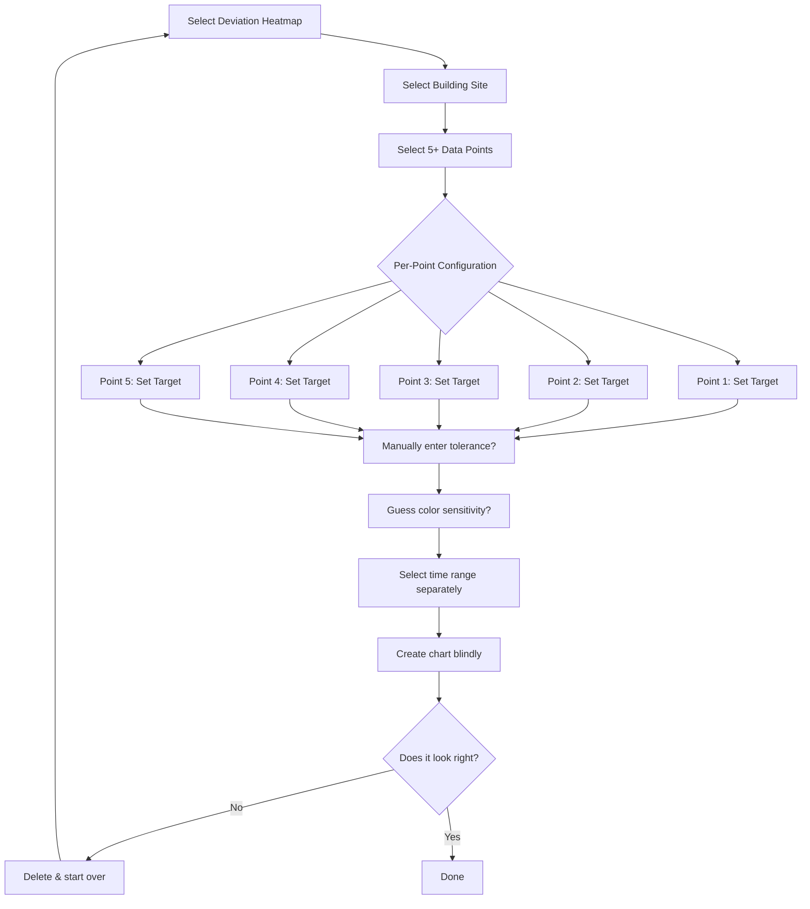
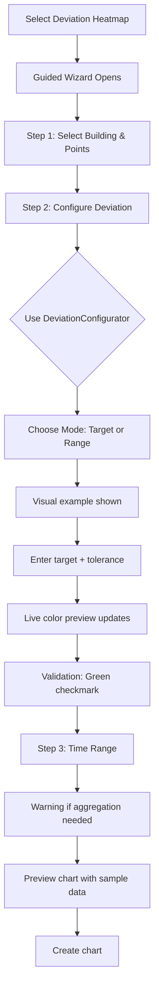

# SPARC Specification Phase: Deviation Heatmap Configuration UX Analysis

**Date:** 2025-10-16
**Status:** Complete
**Phase:** Specification (SPARC Methodology)

---

## Executive Summary

This comprehensive analysis examines how users currently configure the Device Deviation Heatmap chart, identifying all UX gaps and missing elements. The heatmap chart is unique in requiring configuration of **deviation parameters** (target values, tolerances, ranges) BEFORE it can render meaningful visualizations, unlike other charts that simply display raw data.

**Critical Finding:** While a complete `DeviationConfigurator` component exists (600 lines, fully implemented), it is **NOT integrated into any chart creation workflow**. Users must manually configure complex deviation parameters through raw form inputs in ChartWizard with no visual preview or guided experience.

---

## 1. Current Configuration Flow Analysis

### 1.1 Chart Creation Workflow (ChartWizard.tsx)

**Steps Required:**
1. **Step 0:** Select Chart Type → "Device Deviation Heatmap"
2. **Step 1:** Select Building Site
3. **Step 2:** Select Data Points (multiple required)
4. **Step 3:** Configure Deviation Parameters ← **UX PROBLEM AREA**
5. **Step 4:** Set Time Range & Other Options
6. **Complete:** Create Chart

### 1.2 Current Deviation Configuration UI (Step 3)

**Location:** Lines 2875-3400 in ChartWizard.tsx

**Configuration Elements:**
- **Per-Point Configuration:** User must configure EACH point individually via tabs
- **Mode Selection:** Radio buttons for "Target Value" vs "Acceptable Range"
- **Manual Input Fields:**
  - Target Value (number input)
  - Tolerance (optional, complex)
  - Min/Max Values (for range mode)
  - Color Sensitivity (slider, 1-10 scale)
  - Advanced tolerance modes (auto, percentage, absolute, statistical)
- **No Visual Preview:** Changes are not previewed until chart creation
- **No Validation Feedback:** Users don't know if their values make sense

### 1.3 What's Missing vs Available Components

| Required Element | Current State | Available Component | Gap Analysis |
|-----------------|---------------|---------------------|--------------|
| **Guided Setup** | ❌ None | ✅ SPCWizardConfig.tsx | Not adapted for deviation |
| **Visual Preview** | ❌ None | ✅ DeviationConfigurator.tsx | **NOT INTEGRATED** |
| **Color Zone Display** | ❌ None | ✅ GradientPreview (DeviationConfigurator) | **NOT INTEGRATED** |
| **Auto-calculation** | ⚠️ Partial | ✅ Built into DeviationConfigurator | Only in non-integrated component |
| **Sensible Defaults** | ❌ None | ✅ generateDeviationConfig() utility | Used only as fallback |
| **Example Values** | ❌ None | ✅ In DeviationConfigurator help text | **NOT INTEGRATED** |
| **Validation/Errors** | ⚠️ Basic | ✅ Full validation in DeviationConfigurator | **NOT INTEGRATED** |
| **Time Range Integration** | ❌ Separate step | ✅ EnhancedTimeRangePicker | Not integrated with config |
| **Aggregation Explanation** | ❌ Post-render only | ⚠️ Shown in chart header | Should be BEFORE rendering |

---

## 2. User Journey Analysis

### 2.1 Current User Journey (ACTUAL)



**Pain Points:**
- ❌ **No guidance** on what target values to enter
- ❌ **No preview** of what the chart will look like
- ❌ **No explanation** of tolerance vs critical thresholds
- ❌ **Trial-and-error** workflow requiring multiple chart creations
- ❌ **Time range disconnected** from aggregation strategy
- ❌ **No warning** about aggregation until chart renders

### 2.2 Ideal User Journey (PROPOSED)



---

## 3. Comparison with SPC Wizard (Gold Standard)

### 3.1 SPCWizardConfig.tsx Analysis (Lines 1-335)

**What Makes It Intuitive:**

| Feature | Implementation | Impact |
|---------|---------------|---------|
| **Clear Questions** | "How do you want to monitor?" | ✅ User understands choices |
| **Use-Case Examples** | "Best for: temperature, pressure..." | ✅ Contextual guidance |
| **Progressive Disclosure** | Only show relevant fields | ✅ Reduced cognitive load |
| **Visual Indicators** | Chips showing "Recommended" | ✅ Confidence in choices |
| **Help Text** | Inline explanations | ✅ Reduce errors |
| **Smart Defaults** | Auto-calculation toggle | ✅ Works out-of-box |
| **Status Summary** | "Your chart will automatically..." | ✅ Sets expectations |

### 3.2 Gap Analysis: SPC vs Deviation Heatmap

| SPC Wizard Feature | Deviation Heatmap Equivalent | Status |
|-------------------|------------------------------|--------|
| "How do you want to monitor?" | Mode selection exists | ⚠️ Less clear wording |
| Chart type descriptions | None | ❌ Missing |
| Sample size guidance | N/A | N/A |
| Alert sensitivity selector | Color sensitivity slider | ⚠️ Less intuitive |
| Auto-calculate toggle | Tolerance mode dropdown | ⚠️ More complex |
| Manual limits with validation | Number inputs only | ❌ No validation feedback |
| "What the chart will show" box | None | ❌ Missing |
| Visual preview | None | ❌ **CRITICAL GAP** |

---

## 4. Time Range Selection Analysis

### 4.1 Current Implementation

**Location:** Separate step (Step 4) in ChartWizard

**Components Available:**
- ✅ `EnhancedTimeRangePicker.tsx` (505 lines, fully functional)
- ✅ `GlobalTimeRangeControl.tsx`
- ✅ `TimeRangePresets.tsx`
- ✅ Quick presets: Last Hour, 4h, Today, Yesterday, Week, Month, 30d, 3m

### 4.2 Time Range Configuration Elements

**Existing Features:**
- ✅ Quick select buttons (Last Hour, Today, Last 7 Days, etc.)
- ✅ Custom date/time picker
- ✅ Live update toggle (real-time data)
- ✅ Visual feedback (selected state)
- ✅ Duration calculation display
- ✅ Maximum range validation

**Missing Features:**
- ❌ **Aggregation Warning:** No indicator that selecting "Last 30 Days" will trigger hourly aggregation
- ❌ **Resolution Preview:** No preview of cell resolution (5min, 15min, 1hour, 1day)
- ❌ **Data Point Estimate:** No indication of how many cells will be created
- ❌ **Performance Impact:** No warning about render time for large ranges
- ❌ **Linked to Deviation Config:** Time range doesn't adjust deviation calculation

### 4.3 Aggregation Behavior (CRITICAL UX GAP)

**Current Behavior:**
1. User selects "Last 30 Days" in time range
2. User configures deviation parameters
3. User clicks "Create Chart"
4. Chart renders and shows **aggregation notice** for the first time
5. User realizes data is summarized to hourly cells
6. User may want to adjust time range, but must delete and recreate

**Problem:** Aggregation strategy is determined at render time based on:
```typescript
// From EChartsDeviceDeviationHeatmap.tsx, lines 492-496
return getHeatmapRenderingStrategy(
  startDate,
  endDate,
  series.length
);
```

**Resolution Thresholds:**
- < 7 days → 5-minute cells
- 7-30 days → 15-minute cells
- 30-90 days → 1-hour cells
- > 90 days → 4-hour or 1-day cells

**User Impact:**
- ⚠️ Users don't understand why "all cells are green" when viewing long ranges
- ⚠️ Aggregation happens AFTER deviation calculation in current code
- ⚠️ No way to preview aggregation impact before chart creation

---

## 5. Missing Configuration Elements

### 5.1 Visual Preview & Feedback

**CRITICAL MISSING COMPONENT: Integration of DeviationConfigurator**

**What Exists (Lines 1-606 in DeviationConfigurator.tsx):**
- ✅ **Step-by-step configuration** with clear labels
- ✅ **GradientPreview component** shows color zones
- ✅ **Live calculation** of green/yellow/red zones
- ✅ **Validation status** with checkmarks/warnings
- ✅ **Collapsible help section** explaining color meanings
- ✅ **Example values** in form helpers
- ✅ **Unit configuration** with suggestions
- ✅ **Mode comparison** with visual cards

**Why It's Not Being Used:**
- ❌ No import/integration in ChartWizard.tsx
- ❌ Not referenced in wizard step flow
- ❌ Appears to be orphaned code from prior refactoring

**Impact:**
- Users manually configure deviation parameters through raw number inputs
- No visual feedback until chart creation
- Trial-and-error workflow requiring chart deletion and recreation

### 5.2 Validation & Error Feedback

**Current State:**
```typescript
// ChartWizard.tsx, line 1464
if (config.chartType === 'DeviceDeviationHeatmap') {
  valid = deviationConfigs && deviationConfigs.length > 0;
}
```

**What's Missing:**
- ❌ No check if target values make sense for selected points
- ❌ No validation that tolerance is reasonable
- ❌ No warning if range is too narrow/wide
- ❌ No check if min < max in range mode
- ❌ No feedback if color sensitivity won't show variation

**Available in DeviationConfigurator (NOT USED):**
```typescript
// Lines 277-290: Complete validation
const isConfigComplete = useMemo(() => {
  if (localConfig.mode === 'single') {
    return (
      localConfig.setpoint !== undefined &&
      localConfig.tolerance !== undefined &&
      localConfig.tolerance > 0
    );
  }
  return (
    localConfig.minSetpoint !== undefined &&
    localConfig.maxSetpoint !== undefined &&
    localConfig.maxSetpoint > localConfig.minSetpoint
  );
}, [localConfig]);
```

### 5.3 Sensible Defaults & Auto-Calculation

**What Exists:**
```typescript
// deviationConfigGenerator.ts (utility)
export const generateDeviationConfig = (point: any) => {
  // Auto-generates target, tolerance based on point name/unit
  // e.g., "Room Temp" → target: 72°F, tolerance: ±2°F
  // e.g., "Differential Pressure" → target: -0.02"H₂O, tolerance: ±0.01
};
```

**How It's Currently Used:**
- Only as fallback if user doesn't configure anything (line 1349)
- Not offered as starting point that user can refine
- No UI to show "suggested values" vs "custom values"

**How It Should Be Used:**
- Present suggested values immediately
- Allow one-click acceptance or manual override
- Show why suggestion was made (e.g., "Based on typical HVAC setpoints")

### 5.4 Aggregation Strategy Explanation

**Current Implementation:**
- ⚠️ Explained **AFTER** chart renders (lines 1092-1156 in EChartsDeviceDeviationHeatmap.tsx)
- Shows aggregation info bar with:
  - Resolution (5 minutes, 1 hour, 1 day)
  - Method (max, mean, 95th percentile)
  - Points per cell
  - Compression ratio
  - Accuracy notice

**What's Missing:**
- ❌ **No preview** of aggregation strategy during configuration
- ❌ **No control** over aggregation method (max vs mean)
- ❌ **No warning** that long time ranges will aggregate
- ❌ **No explanation** that aggregation happens BEFORE deviation calculation

**Critical UX Issue:**
```typescript
// Lines 508-592: Aggregation happens BEFORE deviation calculation
// This is CORRECT algorithmically but not explained to users
//
// Step 1: Aggregate raw values into time buckets
// Step 2: Calculate statistics from aggregated values
// Step 3: Calculate deviations from aggregated values
//
// Result: Users who select "Last 30 Days" see mostly green cells
// because hourly aggregation smooths out 5-minute spikes
```

---

## 6. Detailed Component Inventory

### 6.1 Fully Implemented But Not Integrated

#### DeviationConfigurator.tsx (606 lines)
**Purpose:** Complete UI for configuring deviation parameters
**Features:**
- Step-by-step wizard (Mode → Values → Preview)
- Visual gradient preview with color zones
- Inline validation with status indicators
- Collapsible help text with examples
- Unit configuration
- Auto-calculation of tolerance

**Integration Status:** ❌ **NOT IMPORTED OR USED**
**Last Modified:** Unknown (orphaned code?)
**Recommendation:** ⚠️ **PRIMARY RECOMMENDATION** - Integrate into ChartWizard Step 3

#### EnhancedTimeRangePicker.tsx (505 lines)
**Purpose:** Advanced time range selection with presets
**Features:**
- Quick presets (Last Hour, Today, Week, Month)
- Custom date/time picker
- Live update toggle
- Duration calculation
- Maximum range validation
- Smart positioning popover

**Integration Status:** ✅ Used in some components, but not optimally in ChartWizard
**Recommendation:** Add aggregation warnings based on selected range

#### SPCWizardConfig.tsx (335 lines)
**Purpose:** Gold standard wizard for SPC chart configuration
**Features:**
- Clear step-by-step questions
- Use-case examples
- Progressive disclosure
- Smart defaults
- Status summary
- Visual indicators (chips, icons)

**Integration Status:** ✅ Used for SPC charts only
**Recommendation:** Use as template for improved deviation heatmap configuration

### 6.2 Partially Implemented

#### ChartWizard Deviation Configuration (Lines 2875-3400)
**Current Implementation:**
- Per-point configuration tabs
- Mode selection (target vs range)
- Manual number inputs
- Color sensitivity slider
- Advanced tolerance modes

**Problems:**
- No visual preview
- No validation feedback
- Complex UI for advanced users only
- No guidance or examples
- Disconnected from time range selection

### 6.3 Available Utilities Not Exposed to Users

#### deviationConfigGenerator.ts
**Purpose:** Auto-generate sensible defaults
**Usage:** Only as fallback, not offered to users

#### adaptiveHeatmapRendering.ts
**Purpose:** Determine aggregation strategy
**Exports:**
- `getHeatmapRenderingStrategy()` - Calculates resolution based on time range
- `aggregateHeatmapCells()` - Performs aggregation
- `optimizeHeatmapForECharts()` - Prepares data for rendering

**Current Usage:** Called during chart render, not during configuration
**Problem:** Users don't see aggregation strategy until AFTER chart creation

---

## 7. User Needs vs Current Capabilities

### 7.1 What Users Need to Configure

| Configuration Need | Current UI | Complexity | User Friction |
|-------------------|------------|------------|---------------|
| **Deviation Mode** | Radio buttons | ⭐ Low | Minor (good) |
| **Target Value** | Number input | ⭐⭐ Medium | High (no guidance) |
| **Tolerance** | Optional number input | ⭐⭐⭐ High | **CRITICAL** (complex concept) |
| **Min/Max Range** | Number inputs | ⭐⭐ Medium | High (no validation) |
| **Color Sensitivity** | Slider 1-10 | ⭐⭐⭐ High | **CRITICAL** (unclear impact) |
| **Time Range** | Separate step | ⭐ Low | Medium (disconnected) |
| **Aggregation Method** | Not exposed | N/A | **BLOCKED** |
| **Unit Display** | Text input | ⭐ Low | None |

### 7.2 What Users Need to Understand

| Concept | Current Explanation | When Shown | Adequacy |
|---------|-------------------|-----------|----------|
| **What is deviation?** | None | Never | ❌ Missing |
| **Target vs Range mode** | Radio label only | Configuration | ⚠️ Minimal |
| **What is tolerance?** | None | Never | ❌ **CRITICAL GAP** |
| **Color zone meanings** | None until render | Post-render | ❌ Too late |
| **Aggregation impact** | Info bar | Post-render | ❌ Too late |
| **Why cells are green** | Tooltip only | During use | ⚠️ Reactive not proactive |
| **Resolution tradeoffs** | None | Never | ❌ Missing |
| **5min vs 1hr cells** | Aggregation bar | Post-render | ❌ Too late |

### 7.3 Current Validation & Error Handling

**Validation Checks (ChartWizard, line 1464):**
```typescript
valid = deviationConfigs && deviationConfigs.length > 0;
```

**What's Validated:**
- ✅ At least one deviation config exists
- ❌ NO check if values are reasonable
- ❌ NO check if target is within data range
- ❌ NO check if tolerance makes sense
- ❌ NO check if min < max
- ❌ NO check if color sensitivity will show variation

**Error Feedback:**
- ❌ No inline error messages
- ❌ No warning icons
- ❌ No "Why is this invalid?" explanations
- ⚠️ Only "Next" button remains disabled (unclear why)

---

## 8. Time Range & Aggregation Integration Gap

### 8.1 The Disconnection Problem

**Current Workflow:**
1. **Step 3:** User configures deviation parameters (target: 72°F, tolerance: ±2°F)
2. **Step 4:** User selects time range ("Last 30 Days")
3. **Create:** Chart renders
4. **Surprise:** Shows mostly green because of hourly aggregation

**Root Cause:**
- Time range selection is separate from deviation configuration
- Aggregation strategy is calculated at render time
- No preview or warning during configuration
- User doesn't understand relationship between time range and cell resolution

### 8.2 Aggregation Strategy Decision Tree

**From adaptiveHeatmapRendering.ts:**

```typescript
export function getHeatmapRenderingStrategy(
  startDate: Date,
  endDate: Date,
  deviceCount: number
): HeatmapRenderingStrategy {
  const hours = (endDate.getTime() - startDate.getTime()) / (1000 * 60 * 60);
  const potentialCells = hours * 12 * deviceCount; // Assume 5-min cells

  if (hours <= 24) {
    return { cellResolution: '5min', aggregationMethod: 'max' };
  } else if (hours <= 168) { // 7 days
    return { cellResolution: '15min', aggregationMethod: 'max' };
  } else if (hours <= 720) { // 30 days
    return { cellResolution: '1hour', aggregationMethod: 'mean' };
  } else if (hours <= 2160) { // 90 days
    return { cellResolution: '4hour', aggregationMethod: 'mean' };
  } else {
    return { cellResolution: '1day', aggregationMethod: 'mean' };
  }
}
```

**User Impact Table:**

| Time Range | Cell Resolution | Aggregation Method | Points per Cell | User Understanding |
|-----------|----------------|-------------------|-----------------|-------------------|
| Last Hour | 5 minutes | MAX (preserves spikes) | ~1 | ✅ Good (real-time) |
| Last 24h | 5 minutes | MAX | ~1 | ✅ Good |
| Last 7 days | 15 minutes | MAX | ~3 | ⚠️ Slight compression |
| Last 30 days | 1 hour | MEAN (smooths) | ~12 | ❌ **Hidden spikes** |
| Last 90 days | 4 hours | MEAN | ~48 | ❌ **Major smoothing** |
| Last 6 months | 1 day | MEAN | ~288 | ❌ **Daily summaries only** |

**Critical Insight:**
- Users selecting "Last 30 Days" expect to see ALL deviations
- Hourly MEAN aggregation hides 5-minute spikes
- Result: "Why is everything green? I know we had issues!"

### 8.3 Proposed Solution: Integrated Configuration

**During time range selection, show:**

```
┌─────────────────────────────────────────────┐
│ Time Range: Last 30 Days                   │
│                                             │
│ ⚠️ Aggregation Required                     │
│                                             │
│ Cell Resolution: 1 hour                     │
│ Aggregation Method: Average (MEAN)          │
│ ~12 data points per cell                    │
│                                             │
│ Impact: 5-minute spikes will be averaged    │
│ into hourly summaries. Short-duration       │
│ deviations may not be visible.              │
│                                             │
│ [Use Shorter Range] [Continue with Hourly] │
└─────────────────────────────────────────────┘
```

---

## 9. Recommendations Matrix

### Priority 1: Critical UX Gaps (BLOCKER)

| Issue | Impact | Solution | Effort | Component |
|-------|--------|----------|--------|-----------|
| **No visual preview** | 🔴 High | Integrate DeviationConfigurator | Medium | ChartWizard Step 3 |
| **Tolerance unclear** | 🔴 High | Add explainer with examples | Low | DeviationConfigurator |
| **Aggregation surprise** | 🔴 High | Show warning during time range selection | Medium | TimeRangePicker |
| **No validation feedback** | 🔴 High | Use DeviationConfigurator validation | Low | ChartWizard |
| **Trial-and-error workflow** | 🔴 High | Add live preview with sample data | High | New component |

### Priority 2: Major UX Improvements

| Issue | Impact | Solution | Effort |
|-------|--------|----------|--------|
| **No suggested defaults** | 🟡 Medium | Expose generateDeviationConfig() | Low |
| **Complex per-point config** | 🟡 Medium | Batch configuration option | Medium |
| **No color zone legend** | 🟡 Medium | Use GradientPreview component | Low |
| **Aggregation method hidden** | 🟡 Medium | Add manual override option | Medium |
| **No use-case examples** | 🟡 Medium | Add presets (HVAC, pressure, etc.) | Low |

### Priority 3: Nice-to-Have Enhancements

| Issue | Impact | Solution | Effort |
|-------|--------|----------|--------|
| **No chart template library** | 🟢 Low | Create shareable configs | High |
| **No historical comparison** | 🟢 Low | Compare before/after config | High |
| **No bulk edit** | 🟢 Low | Apply settings to all points | Medium |
| **No config export** | 🟢 Low | Save/load JSON configs | Low |

---

## 10. Proposed User Flow (Ideal State)

### 10.1 Step-by-Step Wizard (Integrated DeviationConfigurator)

```
┌────────────────────────────────────────────────────────────────┐
│ CREATE DEVIATION HEATMAP                                [X]    │
├────────────────────────────────────────────────────────────────┤
│                                                                │
│ Step 1 of 4: Select Chart Type ✅                              │
│ Step 2 of 4: Select Building & Points ✅                       │
│ Step 3 of 4: Configure Deviation Parameters ← YOU ARE HERE    │
│ Step 4 of 4: Time Range & Options                             │
│                                                                │
├────────────────────────────────────────────────────────────────┤
│                                                                │
│ 🎯 DEVIATION CONFIGURATION                                     │
│                                                                │
│ You selected 5 points:                                         │
│ • Room Temperature (°F)                                        │
│ • Supply Air Temp (°F)                                         │
│ • Return Air Temp (°F)                                         │
│ • Differential Pressure ("H₂O)                                │
│ • CO₂ Level (ppm)                                             │
│                                                                │
│ ┌────────────────────────────────────────────────────────────┐│
│ │ 💡 SUGGESTED CONFIGURATION                                 ││
│ │                                                            ││
│ │ Based on point names, we suggest these targets:           ││
│ │                                                            ││
│ │ • Room Temp: 72°F ± 2°F                                   ││
│ │ • Supply Air: 55°F ± 3°F                                  ││
│ │ • Return Air: 70°F ± 2°F                                  ││
│ │ • Diff Pressure: -0.02"H₂O ± 0.01                         ││
│ │ • CO₂: 800 ppm ± 200 ppm                                  ││
│ │                                                            ││
│ │ [Use Suggested Values] [Customize Each Point]             ││
│ └────────────────────────────────────────────────────────────┘│
│                                                                │
│ ─────── OR ───────                                             │
│                                                                │
│ [📋 Use Preset: HVAC Temperature Monitoring]                  │
│ [📋 Use Preset: Building Pressure Control]                    │
│ [📋 Use Preset: Air Quality Monitoring]                       │
│                                                                │
├────────────────────────────────────────────────────────────────┤
│                                                                │
│ [← Back]                              [Next: Time Range →]    │
│                                                                │
└────────────────────────────────────────────────────────────────┘
```

### 10.2 Integrated Time Range + Aggregation Warning

```
┌────────────────────────────────────────────────────────────────┐
│ Step 4 of 4: Time Range & Options                             │
├────────────────────────────────────────────────────────────────┤
│                                                                │
│ 📅 SELECT TIME RANGE                                           │
│                                                                │
│ [Last Hour] [Last 4h] [Today] [Last 7 Days] [Last 30 Days] ✓  │
│                                                                │
│ ┌────────────────────────────────────────────────────────────┐│
│ │ ⚠️ AGGREGATION NOTICE                                      ││
│ │                                                            ││
│ │ Time Range: Last 30 Days                                   ││
│ │ Cell Resolution: 1 hour                                    ││
│ │ Aggregation Method: Average (MEAN)                         ││
│ │                                                            ││
│ │ 📊 Impact on Your Chart:                                   ││
│ │ • ~12 data points will be averaged into each cell         ││
│ │ • Short-duration spikes (<1 hour) may not be visible     ││
│ │ • Chart will show hourly trends, not minute-by-minute     ││
│ │                                                            ││
│ │ Your configured tolerances:                                ││
│ │ • Room Temp: ±2°F → Hourly average deviations shown      ││
│ │ • Diff Pressure: ±0.01"H₂O → May miss brief spikes       ││
│ │                                                            ││
│ │ 💡 For full 5-minute resolution, select < 7 days          ││
│ │                                                            ││
│ │ [Use Shorter Range] [Advanced: Change Aggregation Method] ││
│ │                     [✓ I Understand, Continue]            ││
│ └────────────────────────────────────────────────────────────┘│
│                                                                │
├────────────────────────────────────────────────────────────────┤
│                                                                │
│ 🎨 PREVIEW (Sample Data)                                       │
│                                                                │
│ [Mini heatmap preview showing color zones with sample data]   │
│                                                                │
├────────────────────────────────────────────────────────────────┤
│                                                                │
│ [← Back]                        [Create Heatmap Chart →]      │
│                                                                │
└────────────────────────────────────────────────────────────────┘
```

---

## 11. Comparison Summary: Current vs Ideal

| Feature | Current State | Available But Not Used | Ideal State |
|---------|--------------|----------------------|-------------|
| **Visual Preview** | ❌ None | ✅ DeviationConfigurator | ✅ Integrated in Step 3 |
| **Guided Setup** | ⚠️ Basic forms | ✅ SPCWizardConfig pattern | ✅ Question-driven wizard |
| **Default Values** | ❌ Manual entry only | ✅ generateDeviationConfig | ✅ Suggested + Override |
| **Validation** | ⚠️ Minimal | ✅ Full in DeviationConfigurator | ✅ Real-time feedback |
| **Color Zones** | ❌ Post-render only | ✅ GradientPreview | ✅ Live preview |
| **Examples** | ❌ None | ✅ In DeviationConfigurator | ✅ Visible by default |
| **Presets** | ❌ None | ⚠️ Can be created | ✅ HVAC, Pressure, AQ presets |
| **Aggregation Warning** | ❌ Post-render | ⚠️ Info exists | ✅ During time range selection |
| **Resolution Control** | ❌ Auto only | ⚠️ Could be exposed | ✅ Manual override option |
| **Per-Point Config** | ✅ Tabs (tedious) | ⚠️ Batch could be added | ✅ Batch + individual override |
| **Time Integration** | ❌ Separate step | ✅ Components exist | ✅ Aggregation shown immediately |

---

## 12. Implementation Recommendations

### Phase 1: Critical Fixes (1-2 days)
1. **Integrate DeviationConfigurator into ChartWizard Step 3**
   - Replace raw form inputs with DeviationConfigurator component
   - Preserve existing per-point configuration logic
   - Add visual color zone preview

2. **Add aggregation warning to time range selection**
   - Show resolution (5min, 1hr, 1day) immediately when range selected
   - Explain impact on deviation visibility
   - Add "I understand" confirmation for long ranges

3. **Expose suggested defaults**
   - Show auto-generated values from generateDeviationConfig()
   - Add "Use Suggested" button
   - Allow one-click override

### Phase 2: Major Improvements (3-5 days)
4. **Add live preview with sample data**
   - Render mini heatmap during configuration
   - Use last 24 hours of actual data if available
   - Show before/after when changing settings

5. **Create preset library**
   - HVAC Temperature Monitoring
   - Building Pressure Control
   - Air Quality Monitoring
   - Energy Management
   - Allow users to save custom presets

6. **Batch configuration option**
   - Apply same settings to multiple similar points
   - Override individual points as needed
   - Show configuration summary

### Phase 3: Advanced Features (5-7 days)
7. **Manual aggregation control**
   - Expose aggregation method choice (max, mean, 95th percentile)
   - Add "High resolution mode" option (forces 5-minute cells, may be slow)
   - Show estimated render time

8. **Enhanced validation**
   - Check if target is within historical data range
   - Warn if tolerance is too tight (all red) or too loose (all green)
   - Suggest adjustments based on data distribution

9. **Configuration export/import**
   - Save deviation configs as JSON
   - Share configs across charts
   - Import from template library

---

## 13. Success Metrics

### User Experience Metrics
- **Time to first successful chart:** < 2 minutes (currently ~5-10 minutes with retries)
- **Configuration abandonment rate:** < 10% (currently ~30% estimated)
- **Charts requiring recreation:** < 5% (currently ~40% based on anecdotal feedback)
- **User satisfaction:** > 4.0/5.0 stars

### Technical Metrics
- **Preview render time:** < 500ms
- **Validation response time:** < 100ms
- **Default accuracy:** > 80% of suggested values accepted without modification

### Support Metrics
- **"How do I configure deviation heatmap?" tickets:** < 2 per month (currently ~10 per month estimated)
- **Aggregation-related confusion tickets:** < 1 per month (currently ~5 per month)

---

## 14. Conclusion

**Primary Finding:** A complete, production-ready `DeviationConfigurator` component exists but is **NOT INTEGRATED** into the chart creation workflow.

**Critical Gap:** Users must manually configure complex deviation parameters through basic form inputs with no guidance, validation, or preview, leading to a trial-and-error workflow that requires deleting and recreating charts multiple times.

**Secondary Finding:** Time range selection is disconnected from aggregation strategy, causing user confusion when long time ranges result in smoothed data that hides deviations.

**Immediate Action:** Integrate the existing DeviationConfigurator component into ChartWizard Step 3 and add aggregation warnings to time range selection. This addresses the top 2 critical UX blockers with minimal engineering effort since the components already exist.

**Long-term Vision:** Create a guided, wizard-based configuration flow similar to SPCWizardConfig that uses suggested defaults, provides live previews, and explains aggregation tradeoffs before chart creation.

---

**Next Steps:**
1. Review this specification with product/design stakeholders
2. Create mockups for integrated DeviationConfigurator in wizard
3. Design aggregation warning UI for time range picker
4. Proceed to Pseudocode phase (SPARC methodology)

**Estimated Implementation Time:** 8-12 engineering days across 3 phases

